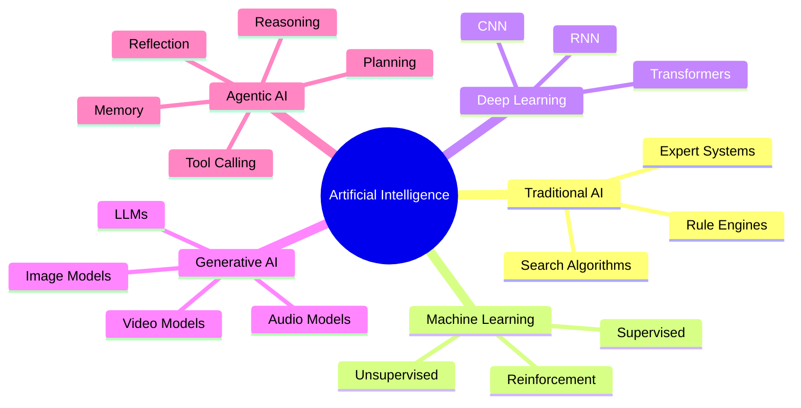
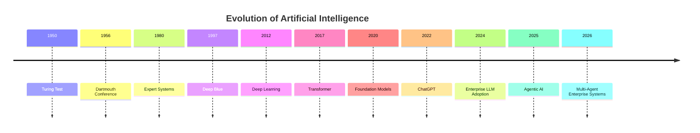
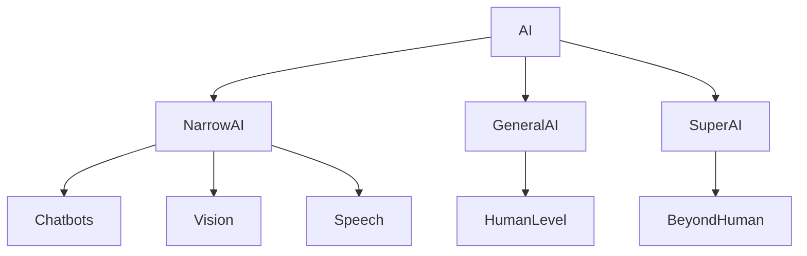
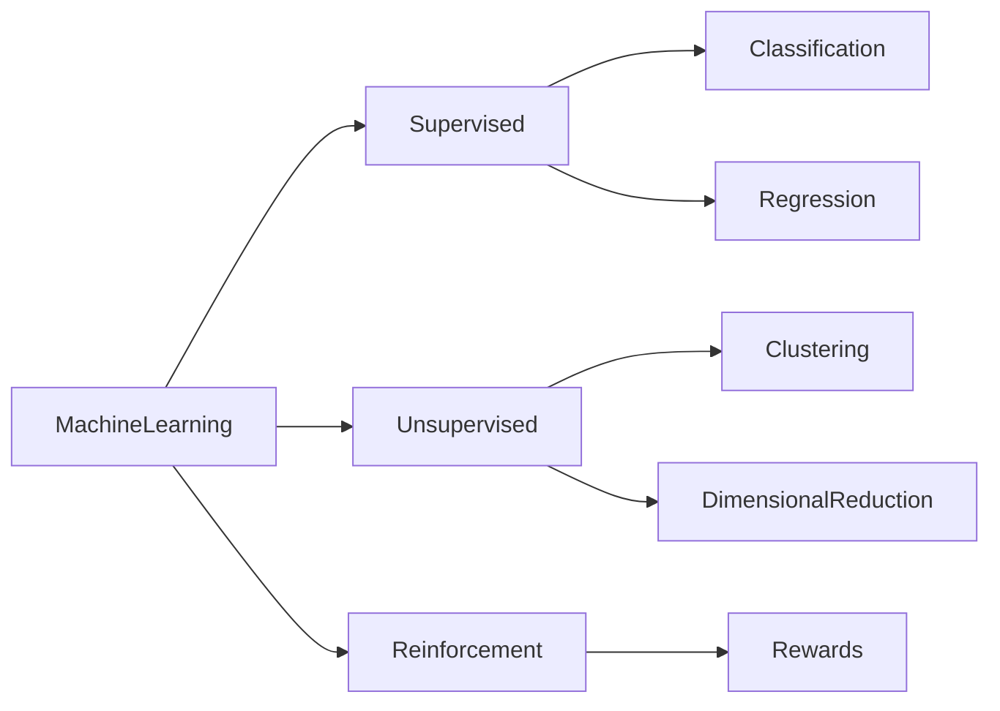
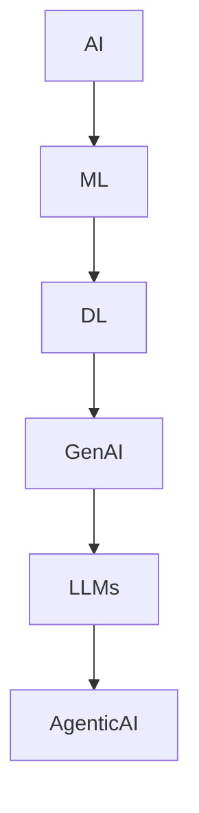
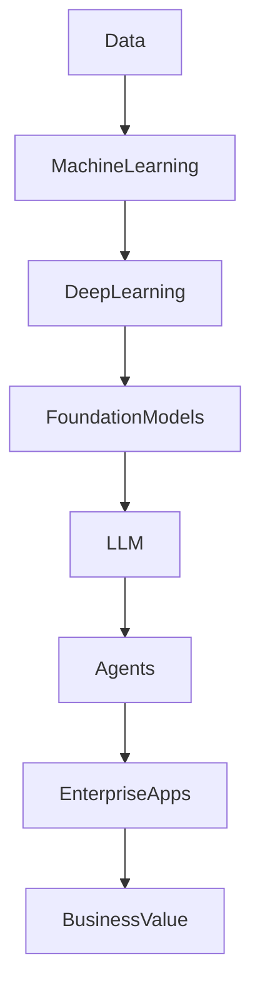

# Chapter 1 - Introduction to Artificial Intelligence

> **Book:** The Complete Agentic AI Handbook (2026 Edition)
>
> **Part I – Foundations**

---

# Learning Objectives

After completing this chapter, you will be able to:

- Understand the history of Artificial Intelligence.
- Differentiate AI, Machine Learning, Deep Learning, Generative AI, and Agentic AI.
- Explain how AI has evolved over the last 70+ years.
- Identify different categories of AI systems.
- Understand current enterprise AI trends.
- Recognize where Agentic AI fits within the AI ecosystem.

---

# Table of Contents

1. What is Artificial Intelligence?
2. Why AI Matters
3. History of AI
4. Evolution of AI
5. AI Categories
6. Types of Learning
7. AI vs ML vs DL vs GenAI vs Agentic AI
8. AI Ecosystem
9. Enterprise AI
10. Real World Applications
11. Challenges
12. Future
13. Summary
14. Interview Questions
15. References

---

# 1. What is Artificial Intelligence?

Artificial Intelligence (AI) is a branch of computer science focused on creating systems capable of performing tasks that traditionally require human intelligence.

These tasks include:

- Learning
- Reasoning
- Problem solving
- Decision making
- Understanding language
- Recognizing images
- Planning
- Interacting with humans

Unlike traditional software, AI systems improve their performance by learning from data or adapting to changing environments.

---

## Traditional Software vs AI

| Traditional Software | Artificial Intelligence       |
| -------------------- | ----------------------------- |
| Rule based           | Data driven                   |
| Explicit programming | Learns patterns               |
| Deterministic        | Probabilistic                 |
| Fixed behavior       | Adaptive behavior             |
| Limited flexibility  | Can generalize                |
| Predictable          | May produce different outputs |

---

# High-Level AI Landscape



---

# 2. Why AI Matters

AI is transforming every major industry by enabling intelligent automation, improved decision-making, and new forms of human–computer collaboration.

### Business Drivers

- Increased productivity
- Reduced operational costs
- Improved customer experience
- Better decision support
- Faster software development
- Automation of repetitive tasks
- Personalized services

### Technical Drivers

- Large-scale cloud computing
- Availability of massive datasets
- Advances in GPUs and TPUs
- Transformer architectures
- Foundation models
- Open-source AI ecosystems

---

# Enterprise Architect Notes

> **Architectural Trade-off**
>
> AI should not replace deterministic business logic where correctness is mandatory (e.g., payment settlement, tax calculation, regulatory reporting).
>
> Instead, AI should augment deterministic systems by:
>
> - interpreting unstructured data,
> - assisting decision-making,
> - automating workflows,
> - generating content,
> - orchestrating tasks.
>
> Enterprise systems should combine **rule-based systems** and **AI-based systems** rather than replacing one with the other.

---

# 3. History of AI

| Year  | Milestone                                                     |
| ----- | ------------------------------------------------------------- |
| 1950  | Alan Turing proposes the Turing Test                          |
| 1956  | Dartmouth Conference coins the term "Artificial Intelligence" |
| 1960s | Symbolic AI and expert systems                                |
| 1970s | First AI winter                                               |
| 1980s | Commercial expert systems                                     |
| 1997  | IBM Deep Blue defeats Garry Kasparov                          |
| 2012  | Deep Learning revolution (AlexNet)                            |
| 2017  | Transformer architecture introduced                           |
| 2022  | ChatGPT popularizes Generative AI                             |
| 2024  | Enterprise adoption of LLMs accelerates                       |
| 2025+ | Rise of Agentic AI and Multi-Agent Systems                    |

---

# Evolution of AI



---

# 4. Evolution of AI

## Phase 1 – Rule-Based AI

Characteristics:

- Human-written rules
- Decision trees
- Expert systems
- Limited adaptability

Example:

```
IF Temperature > 40
THEN Start Fan
```

---

## Phase 2 – Machine Learning

Systems learn statistical patterns from data instead of relying solely on handcrafted rules.

Examples:

- Spam detection
- Fraud detection
- Recommendation engines

---

## Phase 3 – Deep Learning

Deep neural networks enable breakthroughs in:

- Computer vision
- Speech recognition
- Natural language processing

---

## Phase 4 – Generative AI

Generative models create new content.

Examples:

- ChatGPT
- Claude
- Gemini
- Image generation
- Code generation

---

## Phase 5 – Agentic AI

Agentic AI extends Generative AI by adding:

- Planning
- Memory
- Tool usage
- Reflection
- Autonomous execution

---

# 5. Categories of AI



---

## Narrow AI

Focused on one task.

Examples:

- ChatGPT
- Face recognition
- Chess engines

---

## Artificial General Intelligence (AGI)

A hypothetical AI capable of performing any intellectual task a human can perform.

Characteristics:

- General reasoning
- Cross-domain learning
- Adaptability
- Transfer learning

---

## Artificial Super Intelligence (ASI)

A theoretical form of AI surpassing human intelligence across all domains.

Currently speculative.

---

# 6. Types of Machine Learning



---

## Supervised Learning

Uses labeled data.

Examples:

- Loan approval
- Disease prediction
- Email spam filtering

---

## Unsupervised Learning

Finds hidden structures without labels.

Examples:

- Customer segmentation
- Anomaly detection

---

## Reinforcement Learning

Learns through rewards and penalties.

Examples:

- Robotics
- Game playing
- Autonomous vehicles

---

# 7. AI vs ML vs DL vs GenAI vs Agentic AI

| Technology              | Primary Capability   | Example                         |
| ----------------------- | -------------------- | ------------------------------- |
| Artificial Intelligence | Intelligent behavior | Expert system                   |
| Machine Learning        | Learn from data      | Fraud detection                 |
| Deep Learning           | Neural networks      | Image recognition               |
| Generative AI           | Create new content   | ChatGPT                         |
| Agentic AI              | Plan, reason, act    | Autonomous enterprise assistant |

---

# Relationship Diagram



---

# 8. AI Ecosystem



---

# Enterprise AI

Modern enterprise AI systems typically include:

- Foundation models
- Retrieval-Augmented Generation (RAG)
- Vector databases
- Enterprise APIs
- Agent orchestration
- Observability
- Security and governance

These topics are explored in later chapters:

- Chapter 8 – Agent Architecture
- Chapter 15 – Retrieval-Augmented Generation (RAG)
- Chapter 17 – Vector Databases
- Chapter 21 – Model Context Protocol (MCP)
- Chapter 22 – Agent-to-Agent (A2A)
- Chapter 24 – AI Gateway

---

# Common Enterprise Use Cases

## Banking

- Fraud detection
- Loan underwriting
- Customer support
- AML monitoring

## Healthcare

- Clinical documentation
- Medical imaging
- Drug discovery

## Retail

- Product recommendations
- Dynamic pricing
- Inventory forecasting

## Manufacturing

- Predictive maintenance
- Quality inspection

## Software Engineering

- Code generation
- Test generation
- Documentation
- Architecture reviews

---

# Common Misconceptions

### ❌ AI is always correct.

AI systems generate probabilistic outputs and can make mistakes or hallucinate.

---

### ❌ AI replaces all software.

AI complements traditional software. Deterministic systems remain essential for core business logic.

---

### ❌ More parameters always mean better performance.

Model quality depends on architecture, training data, evaluation, and task suitability—not just parameter count.

---

### ❌ AI does not require governance.

Enterprise AI must include:

- Security
- Compliance
- Auditability
- Monitoring
- Human oversight

---

# Production Considerations

When deploying AI in enterprise environments, architects should evaluate:

## Scalability

- Horizontal scaling
- Model routing
- Caching
- Rate limiting

## Reliability

- Fallback models
- Retry policies
- Circuit breakers

## Security

- Authentication
- Authorization
- Secret management
- Data encryption

## Observability

- Prompt logging
- Token usage
- Latency
- Tool invocation tracing

## Governance

- Policy enforcement
- Human approval workflows
- Compliance monitoring
- Responsible AI practices

---

# Principal Architect Interview Focus

Interviewers commonly ask:

- Why is AI not suitable for every business problem?
- How do you decide between deterministic logic and AI?
- How would you introduce AI into a regulated enterprise?
- What are the biggest risks of enterprise AI adoption?
- How would you design an AI platform shared across multiple business domains?

Be prepared to discuss architecture decisions, governance, integration strategies, and trade-offs.

---

# Chapter Summary

In this chapter, you learned:

- The definition and goals of Artificial Intelligence.
- The historical evolution from symbolic AI to Agentic AI.
- The distinctions between AI, Machine Learning, Deep Learning, Generative AI, and Agentic AI.
- Categories of AI systems.
- Enterprise applications of AI.
- Key architectural considerations for deploying AI responsibly.

These foundations will support the deeper topics covered in the upcoming chapters.

---

# Key Takeaways

- AI is a broad field encompassing multiple techniques.
- Machine Learning enables systems to learn from data.
- Deep Learning powers modern foundation models.
- Generative AI creates new content.
- Agentic AI adds planning, reasoning, memory, and autonomous action.
- Enterprise AI requires robust architecture, governance, and security.

---

# Interview Questions

1. What is Artificial Intelligence?
2. Explain the evolution of AI.
3. Differentiate AI, ML, DL, Generative AI, and Agentic AI.
4. What are the three categories of AI?
5. Why is AI considered probabilistic?
6. When should AI not be used?
7. What are the main enterprise applications of AI?
8. What are the biggest challenges in deploying AI at scale?
9. How does Agentic AI differ from Generative AI?
10. What architectural considerations are important for enterprise AI platforms?

---

# References

- Alan Turing, _Computing Machinery and Intelligence_ (1950)
- Russell & Norvig, _Artificial Intelligence: A Modern Approach_
- Stanford CS224N – Natural Language Processing with Deep Learning
- Google Research – Transformer Architecture
- OpenAI – GPT Models
- Anthropic – Constitutional AI
- Microsoft – AI Architecture Center
- AWS – Well-Architected Framework for Generative AI

---

# Next Chapter

➡️ **Chapter 2 – Machine Learning**

In the next chapter, we will explore:

- Machine Learning fundamentals
- Learning paradigms
- Model lifecycle
- Training and inference
- Feature engineering
- Bias and variance
- Model evaluation
- Enterprise ML pipelines
