# Chapter 2 - Machine Learning

> **Part I – Foundations**
>
> **Chapter 2**

---

# Learning Objectives

After completing this chapter, you will be able to:

- Explain what Machine Learning is and why it is important.
- Differentiate AI and Machine Learning.
- Understand the Machine Learning workflow.
- Explain supervised, unsupervised and reinforcement learning.
- Understand datasets, labels and features.
- Differentiate training, validation and inference.
- Explain how enterprise Machine Learning systems are built.
- Understand where Machine Learning fits into modern Generative AI.

---

# Table of Contents

1. What is Machine Learning?
2. Why Machine Learning?
3. AI vs Machine Learning
4. Machine Learning Lifecycle
5. Types of Machine Learning
6. Dataset Fundamentals
7. Features and Labels
8. Training, Validation and Testing
9. Model Training
10. Model Inference
11. Enterprise Perspective
12. Summary

---

# 1. What is Machine Learning?

Machine Learning (ML) is a subset of Artificial Intelligence that enables computers to **learn patterns from data instead of being explicitly programmed with rules**.

Instead of writing thousands of rules manually, developers provide historical data, and the ML algorithm discovers relationships within that data to make predictions or decisions.

Unlike traditional software, ML systems improve as more data becomes available.

---

## Traditional Programming vs Machine Learning

Traditional programming follows a deterministic approach:

```text
Rules + Data
      ↓
 Program
      ↓
Output
```

Machine Learning reverses this approach:

```text
Data + Expected Output
            ↓
     Learning Algorithm
            ↓
          Model
```

Later,

```text
New Data
    ↓
Model
    ↓
Prediction
```

---

# Enterprise Architect Notes

> **Machine Learning should not replace deterministic business logic.**
>
> Payment settlement, accounting calculations, tax calculations, inventory balancing, and regulatory reporting should remain deterministic.
>
> Machine Learning is most valuable when:
>
> - patterns are too complex for rules,
> - historical data exists,
> - prediction is more valuable than exact calculation,
> - uncertainty is acceptable.

Examples include:

- Fraud detection
- Credit risk
- Customer churn
- Product recommendation
- Predictive maintenance
- Forecasting

---

# 2. Why Machine Learning?

Modern enterprises generate enormous amounts of data.

Examples:

- Banking transactions
- Medical records
- Customer purchases
- IoT sensor data
- Images
- Videos
- Emails
- Documents
- Application logs

Humans cannot manually analyze billions of records.

Machine Learning enables organizations to:

- detect patterns
- identify anomalies
- make predictions
- automate decisions
- personalize customer experiences

---

## Business Value

| Business Goal                 | Machine Learning Solution |
| ----------------------------- | ------------------------- |
| Increase revenue              | Recommendation systems    |
| Reduce fraud                  | Fraud detection           |
| Improve customer satisfaction | Personalization           |
| Reduce downtime               | Predictive maintenance    |
| Improve efficiency            | Intelligent automation    |
| Improve forecasting           | Time-series prediction    |

---

# 3. AI vs Machine Learning

Many people use AI and Machine Learning interchangeably.

They are not the same.

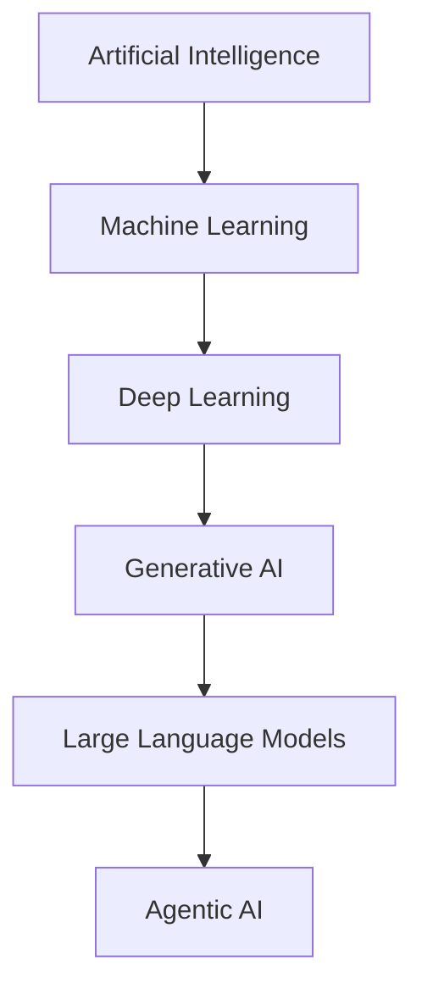

Artificial Intelligence is the broader field.

Machine Learning is one technique used to build intelligent systems.

---

## Comparison

| Artificial Intelligence  | Machine Learning  |
| ------------------------ | ----------------- |
| Broad discipline         | Subset of AI      |
| Includes rules           | Learns from data  |
| Can be symbolic          | Statistical       |
| May not require training | Requires training |
| Can use expert systems   | Uses datasets     |

---

# Common Misconception

❌ **Machine Learning is Artificial Intelligence.**

Not exactly.

Machine Learning is **one approach** to implementing AI.

Other AI techniques include:

- Rule engines
- Search algorithms
- Constraint solving
- Knowledge graphs
- Expert systems

---

# 4. Machine Learning Lifecycle

Every ML project follows a lifecycle.


---

## Step 1 — Business Problem

Everything starts with a business problem.

Examples:

- Detect fraudulent transactions.
- Predict customer churn.
- Forecast demand.
- Recommend products.

Technology should never be the starting point.

---

## Step 2 — Data Collection

Data comes from many sources.

Examples:

- SQL databases
- ERP systems
- CRM
- IoT sensors
- Kafka events
- REST APIs
- Documents
- Images

Enterprise data is rarely clean.

---

## Step 3 — Data Preparation

This is often the most time-consuming step.

Activities include:

- removing duplicates
- handling missing values
- fixing incorrect values
- converting formats
- normalization
- encoding categorical values

Data quality directly affects model quality.

---

## Step 4 — Feature Engineering

Features are transformed into a format suitable for learning.

Examples:

Original:

```
Date of Birth
```

Derived Feature:

```
Age
```

Original:

```
Transaction Timestamp
```

Derived:

```
Hour of Day
Weekend
Business Day
```

Good feature engineering often improves model accuracy more than choosing a different algorithm.

---

## Step 5 — Model Training

The learning algorithm processes historical data to identify patterns.

Examples of algorithms:

- Decision Tree
- Random Forest
- Logistic Regression
- Neural Networks
- Gradient Boosting

The output is a trained model.

---

## Step 6 — Validation

Validation helps tune the model.

Typical tasks:

- Hyperparameter tuning
- Feature selection
- Model comparison

---

## Step 7 — Testing

The model is evaluated using data it has never seen before.

This provides an unbiased estimate of performance.

---

## Step 8 — Deployment

The trained model becomes available through:

- REST APIs
- Batch jobs
- Streaming systems
- Mobile applications
- Enterprise workflows

---

## Step 9 — Monitoring

Models degrade over time.

Reasons:

- Customer behavior changes.
- Economic conditions change.
- Fraud patterns evolve.
- New products appear.

Monitoring detects:

- Accuracy degradation
- Drift
- Latency
- Errors

---

# Production Considerations

Production ML systems require:

- Versioned datasets
- Model registry
- Feature store
- CI/CD
- Monitoring
- Rollback capability
- Audit logs

Unlike traditional applications, ML systems require continuous retraining.

---

# 5. Types of Machine Learning

Machine Learning is generally divided into three major categories.

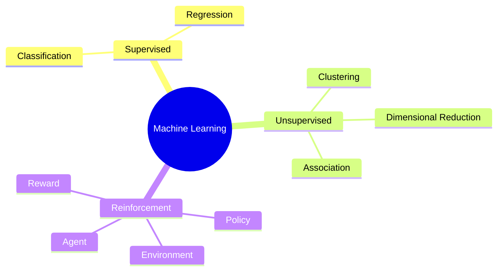

---

# Supervised Learning

The algorithm learns using **labeled data**.

Example:

| Email   | Spam |
| ------- | ---- |
| Offer   | Yes  |
| Meeting | No   |
| Invoice | No   |

The algorithm learns the relationship between the email content and the label.

---

## Enterprise Examples

- Loan approval
- Fraud detection
- Medical diagnosis
- Credit scoring
- Customer churn
- Demand prediction

---

# Unsupervised Learning

No labels exist.

The algorithm discovers hidden patterns.

Example:

Customer segmentation.

The algorithm groups customers based on purchasing behavior.

No human tells it how many groups should exist.

---

## Enterprise Examples

- Customer segmentation
- Market basket analysis
- Anomaly detection
- Document clustering
- Network analysis

---

# Reinforcement Learning

The system learns by interacting with an environment.

```
Action
↓

Reward

↓

Learn

↓

Better Action
```

Instead of labels, it receives rewards.

---

## Enterprise Examples

- Robotics
- Autonomous vehicles
- Supply chain optimization
- Dynamic pricing
- Game playing

---

# Comparison

| Learning Type | Uses Labels | Primary Goal      |
| ------------- | ----------- | ----------------- |
| Supervised    | Yes         | Prediction        |
| Unsupervised  | No          | Pattern Discovery |
| Reinforcement | Rewards     | Decision Making   |

---

# 6. Dataset Fundamentals

A Machine Learning model is only as good as its data.

Common dataset types include:

- Structured
- Semi-structured
- Unstructured

---

## Structured Data

Examples:

- SQL tables
- CSV
- Excel

```text
CustomerID
Age
Salary
Country
```

---

## Semi-Structured Data

Examples:

- JSON
- XML
- Avro
- Parquet

---

## Unstructured Data

Examples:

- Images
- Videos
- PDFs
- Emails
- Audio
- Documents

Large Language Models primarily operate on unstructured data.

---

# Enterprise Architect Notes

One of the biggest challenges in enterprise AI is **data integration**, not model training.

Organizations often have data spread across:

- SAP
- Salesforce
- ServiceNow
- SharePoint
- Legacy databases
- Data lakes
- Kafka streams

A robust enterprise architecture includes pipelines to collect, clean, transform, and govern data before it reaches Machine Learning models.

---

# Cross References

Later chapters build upon these concepts:

- **Chapter 3 – Deep Learning:** Neural networks and representation learning.
- **Chapter 4 – Transformers:** Attention mechanisms and modern NLP.
- **Chapter 5 – Large Language Models:** Foundation models built using deep learning.
- **Chapter 15 – Retrieval-Augmented Generation (RAG):** Combining ML with external knowledge.
- **Chapter 17 – Vector Databases:** Managing embeddings for semantic search.
- **Chapter 27 – Agent Evaluation:** Measuring the quality of AI and agentic systems.

---

---

# 7. Features and Labels

Features and labels are the foundation of supervised Machine Learning.

## What is a Feature?

A **feature** is an input variable used by a model to make predictions.

Examples:

| Problem                | Features                             |
| ---------------------- | ------------------------------------ |
| House Price Prediction | Area, Bedrooms, Location, Age        |
| Fraud Detection        | Amount, Merchant, Country, Device    |
| Customer Churn         | Age, Subscription Length, Complaints |
| Loan Approval          | Income, Credit Score, Employment     |

Features should contain meaningful information that helps predict the desired outcome.

---

## What is a Label?

A label (also called the **target variable**) is the expected output.

Example:

| Income | Credit Score | Loan     |
| ------ | ------------ | -------- |
| 80K    | 750          | Approved |
| 25K    | 580          | Rejected |

Here,

Features:

- Income
- Credit Score

Label:

- Loan Decision

---

## Feature Matrix

Machine Learning usually represents data as:

```
X = Features

Y = Labels
```

```
Model = f(X)

Prediction = Y
```

---

# Feature Engineering

Feature Engineering is the process of creating better input variables.

Often, feature engineering improves model performance more than selecting a more sophisticated algorithm.

---

## Example

Raw Transaction

| Timestamp        | Amount |
| ---------------- | ------ |
| 2026-07-14 22:34 | 4500   |

Derived Features

| Feature           | Value |
| ----------------- | ----- |
| Hour              | 22    |
| Weekend           | Yes   |
| Night Transaction | Yes   |
| High Value        | No    |

These derived features provide richer information for learning.

---

## Types of Feature Engineering

- Feature Creation
- Feature Selection
- Feature Transformation
- Feature Encoding
- Feature Scaling
- Dimensionality Reduction

---

## Feature Scaling

Many algorithms perform better when features have similar ranges.

Example:

Without Scaling

```
Salary = 850000

Age = 32
```

The salary dominates due to its magnitude.

Scaling methods:

- Min-Max Scaling
- Standardization (Z-score)
- Robust Scaling

---

## Encoding Categorical Data

Machine Learning models require numerical input.

Example

```
Country

India
USA
Japan
```

Can become

```
India = 1

USA = 2

Japan = 3
```

or

One-Hot Encoding

```
India  USA  Japan

1       0      0

0       1      0

0       0      1
```

---

# Enterprise Architect Notes

Feature Engineering is where business knowledge becomes extremely valuable.

A fraud analyst can often design better fraud-related features than a generic data scientist.

Successful ML projects require close collaboration between:

- Business Experts
- Data Engineers
- Data Scientists
- ML Engineers
- Enterprise Architects

---

# 8. Training, Validation and Testing

A common mistake is using all available data for training.

Instead, datasets are divided into three parts.

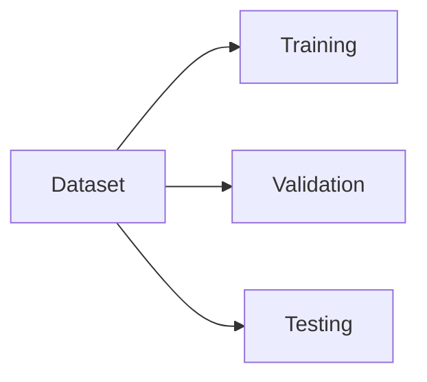

---

## Training Dataset

Purpose:

Teach the model.

Usually:

60–80% of data.

---

## Validation Dataset

Purpose:

Tune hyperparameters.

Compare algorithms.

Select best model.

Typical size:

10–20%

---

## Test Dataset

Purpose:

Final evaluation.

Never used during training.

Provides unbiased performance estimation.

---

## Example Split

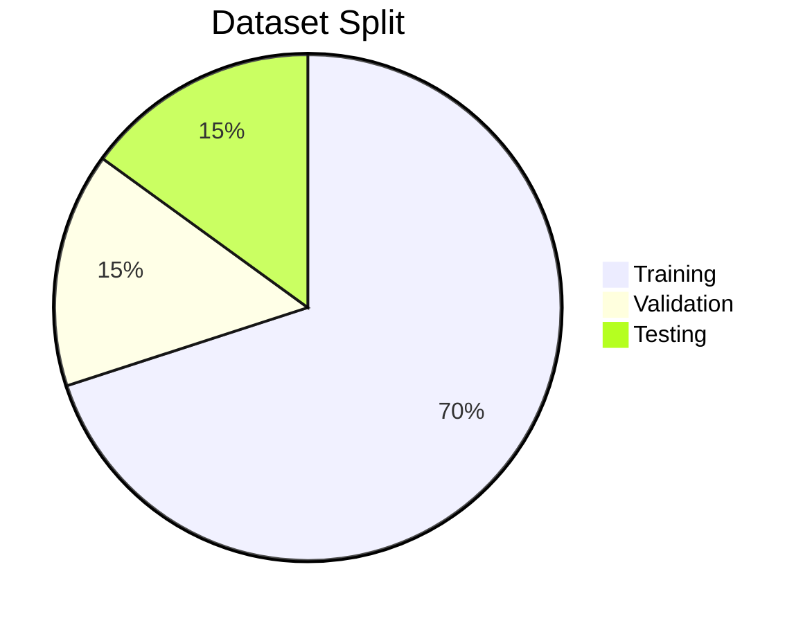

---

# Data Leakage

One of the most common ML mistakes.

Example

Training data accidentally contains future information.

The model appears highly accurate during testing but fails in production.

Always ensure:

- Test data remains unseen.
- No future information leaks into training.

---

# Common Misconception

❌ More training data automatically produces a better model.

Reality:

Poor-quality data often performs worse than a smaller high-quality dataset.

Data quality is more important than data quantity.

---

# 9. Model Training

During training, the algorithm learns mathematical relationships.

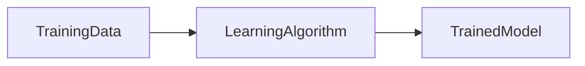

---

## Training Process

Steps

1. Initialize parameters
2. Read training data
3. Make predictions
4. Calculate error
5. Adjust parameters
6. Repeat

This iterative optimization continues until the model converges.

---

## Loss Function

A loss function measures prediction error.

Lower loss indicates better learning.

Examples:

- Mean Squared Error (Regression)
- Cross Entropy (Classification)

---

## Optimization

Optimization minimizes loss.

Common optimizer:

Gradient Descent

```
Prediction

↓

Error

↓

Gradient

↓

Update Parameters

↓

Repeat
```

---

# 10. Model Inference

Inference is the process of using a trained model to make predictions.

Unlike training, inference does not modify the model.


---

## Enterprise Examples

Loan Request

↓

Credit Risk Model

↓

Risk Score

↓

Business Rule Engine

↓

Approve / Reject

Notice that ML often assists—not replaces—business rules.

---

# Online vs Offline Inference

## Batch Inference

Examples

- Monthly churn prediction
- Quarterly forecasting

Advantages

- Cost effective
- Large volumes

---

## Real-Time Inference

Examples

- Fraud detection
- Recommendation engines
- AI assistants

Advantages

- Immediate response

Challenges

- Low latency
- High availability
- Scaling

---

# Enterprise Architect Notes

A common enterprise architecture pattern is:


Business rules remain outside the model.

This improves:

- Explainability
- Compliance
- Governance

---

# 11. Popular Machine Learning Algorithms

Machine Learning contains hundreds of algorithms.

The most commonly used include:

---

## Linear Regression

Purpose

Predict continuous values.

Examples

- House prices
- Sales forecasting

---

## Logistic Regression

Purpose

Binary classification.

Examples

- Spam detection
- Loan approval
- Fraud detection

---

## Decision Trees

Uses hierarchical decision rules.

Advantages

- Easy to explain
- Interpretable

Disadvantages

- Can overfit

---

## Random Forest

Multiple decision trees combined.

Advantages

- Higher accuracy
- Better generalization
- Robust

---

## Support Vector Machine

Suitable for:

- Classification
- Small datasets

---

## K-Means

Unsupervised clustering algorithm.

Enterprise examples:

- Customer segmentation
- Product grouping

---

## Gradient Boosting

Popular implementations

- XGBoost
- LightGBM
- CatBoost

Widely used in:

- Banking
- Finance
- Insurance

---

# Algorithm Selection Guide

| Problem               | Algorithm               |
| --------------------- | ----------------------- |
| House Price           | Linear Regression       |
| Spam Detection        | Logistic Regression     |
| Fraud Detection       | Random Forest, XGBoost  |
| Customer Segmentation | K-Means                 |
| Recommendation        | Collaborative Filtering |
| Image Recognition     | Neural Networks         |

---

# 12. Bias and Variance

Understanding bias and variance is essential.

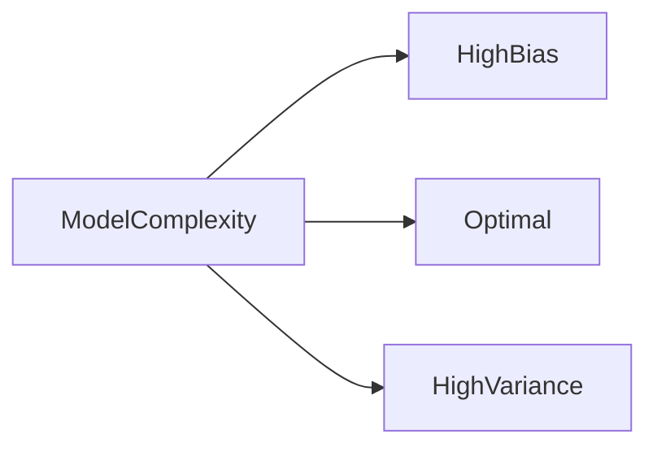

---

## High Bias

Model is too simple.

Symptoms

- Poor training accuracy
- Poor testing accuracy

Called:

Underfitting

---

## High Variance

Model memorizes training data.

Symptoms

- Excellent training accuracy
- Poor testing accuracy

Called:

Overfitting

---

# Underfitting vs Overfitting

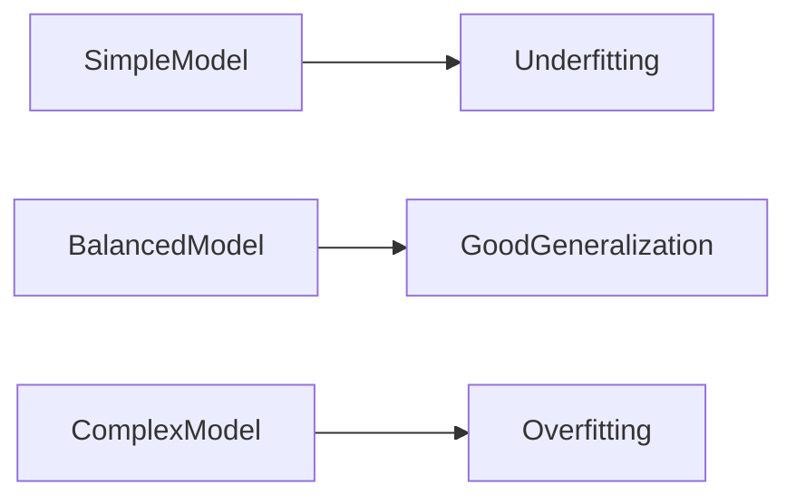

---

# Reducing Overfitting

Techniques

- More data
- Cross validation
- Regularization
- Feature selection
- Early stopping
- Dropout (Deep Learning)

---

# Production Considerations

Enterprise models should generalize well.

Avoid deploying models that only perform well on historical data.

Always evaluate using unseen production-like datasets.

---

# 13. Model Evaluation Metrics

Evaluation depends on the problem type.

---

## Classification

Common metrics

- Accuracy
- Precision
- Recall
- F1 Score
- ROC-AUC

---

## Regression

Common metrics

- Mean Absolute Error (MAE)
- Mean Squared Error (MSE)
- Root Mean Squared Error (RMSE)
- R² Score

---

## Example Confusion Matrix

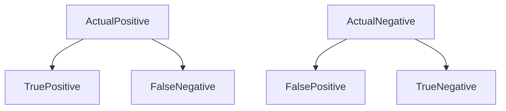

---

## Precision

Question:

When the model predicts positive,

how often is it correct?

---

## Recall

Question:

How many actual positives were detected?

---

## F1 Score

Balances:

- Precision
- Recall

Useful for imbalanced datasets.

---

# Principal Architect Interview Focus

Interviewers often ask:

- Why should we separate training and inference?
- Why is feature engineering often more valuable than algorithm selection?
- What is data leakage?
- Explain overfitting using a banking example.
- How would you deploy an ML model for fraud detection?
- Why should business rules remain separate from ML predictions?
- When would you choose batch inference over real-time inference?

Strong answers should discuss architecture, governance, operational considerations, and business trade-offs—not just algorithms.

---

# Cross References

The concepts introduced here are foundational for later chapters:

- **Chapter 3 – Deep Learning:** Neural networks automate representation learning, reducing the need for manual feature engineering.
- **Chapter 4 – Transformers:** Attention-based architectures that revolutionized NLP and sequence modeling.
- **Chapter 5 – Large Language Models:** Large-scale deep learning models trained on vast datasets.
- **Chapter 15 – RAG:** Enhances model responses with external knowledge retrieval.
- **Chapter 29 – Spring AI:** Integrating predictive models and LLMs into enterprise Java applications.

---

---

# 14. Enterprise Machine Learning Pipeline

Enterprise Machine Learning is significantly more complex than training a model in a Jupyter Notebook. It requires reliable data pipelines, governance, deployment automation, monitoring, security, and continuous improvement.

A production ML system is a complete software platform.


---

# Enterprise ML Components

| Component           | Purpose                      |
| ------------------- | ---------------------------- |
| Data Lake           | Raw enterprise data          |
| Feature Store       | Reusable engineered features |
| Training Pipeline   | Build models                 |
| Model Registry      | Version control for models   |
| CI/CD               | Automated deployment         |
| Monitoring          | Detect issues                |
| Retraining Pipeline | Keep models accurate         |

---

# Feature Store

A Feature Store centralizes reusable features across projects.

Without a Feature Store:

- Teams recreate features
- Different feature definitions
- Inconsistent predictions

With a Feature Store:

```
Customer Age

↓

Shared Feature

↓

Loan Model

Fraud Model

Recommendation Model

Risk Model
```

Benefits

- Reuse
- Consistency
- Governance
- Versioning

---

# Model Registry

A Model Registry stores trained models.

Each model includes:

- Version
- Accuracy
- Training Dataset
- Hyperparameters
- Owner
- Approval Status

Example

| Version  | Status     |
| -------- | ---------- |
| Fraud v1 | Archived   |
| Fraud v2 | Production |
| Fraud v3 | Candidate  |

---

# Enterprise Architect Notes

Treat Machine Learning models exactly like software releases.

Every production model should have:

- Version control
- Rollback capability
- Approval workflow
- Documentation
- Audit trail
- Owner

Never deploy anonymous models.

---

# 15. MLOps

MLOps (Machine Learning Operations) extends DevOps principles to Machine Learning systems.

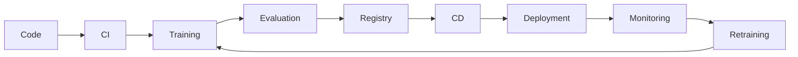

---

## DevOps vs MLOps

| DevOps      | MLOps                       |
| ----------- | --------------------------- |
| Source Code | Source Code + Data + Models |
| Build       | Training                    |
| Package     | Model Artifact              |
| Deploy      | Model Serving               |
| Monitor     | Model + Data Drift          |

---

## MLOps Goals

- Repeatability
- Automation
- Monitoring
- Governance
- Reliability
- Scalability

---

# 16. Data Drift

Models assume future data resembles historical data.

When this assumption fails,

performance drops.

This is called:

**Data Drift**

Example

A fraud model trained in 2023

↓

Customer behavior changes

↓

Fraud techniques evolve

↓

Accuracy declines

---

## Types of Drift

### Data Drift

Input data changes.

Example:

Customers now shop mostly through mobile apps instead of desktops.

---

### Concept Drift

Relationship between input and output changes.

Example:

Fraudsters invent new attack techniques.

---

### Model Drift

Overall model performance degrades over time.

---


---

# Monitoring Machine Learning Systems

Enterprise monitoring goes far beyond CPU and memory utilization.

Important metrics include:

### Model Metrics

- Accuracy
- Precision
- Recall
- F1 Score

---

### Operational Metrics

- API latency
- Throughput
- Error rate
- Availability

---

### Data Metrics

- Missing values
- Distribution changes
- Feature drift

---

### Business Metrics

- Revenue
- Fraud prevented
- Customer satisfaction
- Conversion rate

---

# Production Considerations

Production ML systems should include:

- Health checks
- Retries
- Circuit breakers
- Rate limiting
- Model fallback
- Canary deployment
- Blue-Green deployment

---

# High-Level Production Architecture

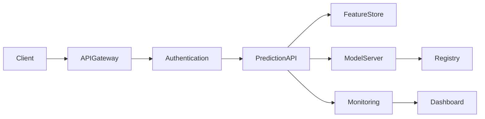

---

# Security Considerations

Machine Learning introduces new security challenges.

---

## Data Privacy

Protect

- Customer information
- Medical records
- Financial transactions

---

## Model Theft

Attackers may attempt to steal models.

Mitigations

- Authentication
- Authorization
- API rate limiting

---

## Prompt Injection

Relevant for LLMs.

Covered in later chapters.

---

## Model Poisoning

Attackers inject malicious training data.

Enterprise defenses

- Data validation
- Human review
- Secure pipelines

---

# Governance

Enterprise AI requires governance.

Areas include:

- Responsible AI
- Explainability
- Auditability
- Compliance
- Human oversight

---

# Enterprise AI Governance

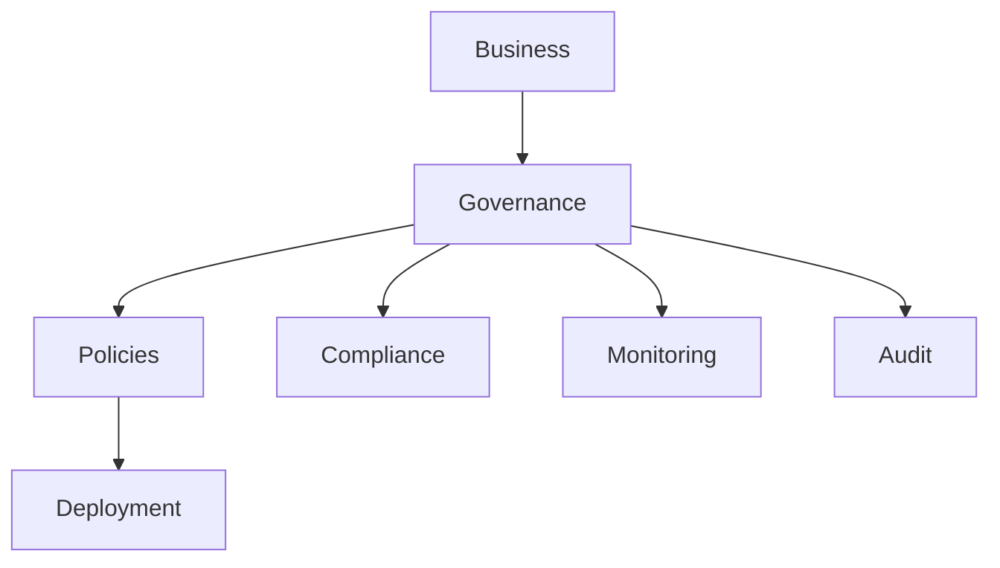

---

# Explainability

Enterprise leaders often ask:

"Why did the model make this prediction?"

Highly regulated industries require explainable decisions.

Examples

- Banking
- Insurance
- Healthcare
- Government

Explainability techniques include:

- Feature Importance
- SHAP Values
- LIME
- Decision Trees

---

# Enterprise Design Pattern

One recommended architecture is AI-Assisted Decision Making.


Notice

The model **assists** decision making.

It does not automatically replace human judgment.

---

# Common Misconceptions

---

## ❌ Higher Accuracy Means Better Model

Not always.

A fraud model with:

99.9% Accuracy

may still miss

80% of fraud cases.

---

## ❌ Machine Learning Eliminates Human Experts

Reality

Successful ML systems combine:

- Domain experts
- Data scientists
- Software engineers
- Enterprise architects

---

## ❌ Models Never Need Retraining

Every production model degrades.

Retraining is inevitable.

---

## ❌ Machine Learning Solves Every Problem

Many business problems are better solved using:

- SQL
- Rules
- Search
- Optimization
- Workflow engines

Choose ML only when pattern recognition is required.

---

# Enterprise Architect Notes

When designing enterprise ML platforms, separate concerns into independent services:

```
Data Layer

↓

Feature Layer

↓

Training Layer

↓

Serving Layer

↓

Monitoring Layer

↓

Governance Layer
```

This modular architecture improves:

- Maintainability
- Scalability
- Team ownership
- Security
- Independent deployments

---

# Principal Architect Interview Focus

Typical interview questions include:

### Architecture

- Design a fraud detection platform.
- Design an enterprise recommendation engine.
- Explain batch vs streaming predictions.
- Explain online inference vs offline inference.

---

### Design

- Why should Feature Stores exist?
- Why separate model serving from applications?
- Why use a Model Registry?

---

### Operations

- What is MLOps?
- Explain Data Drift.
- Explain Concept Drift.
- How would you monitor production models?

---

### Enterprise

- How would you govern enterprise AI?
- How do you secure ML APIs?
- Explain explainable AI.
- How do you version models?
- Describe rollback strategies.

Interview Tip:

Senior architect interviews focus less on algorithm mathematics and more on system architecture, platform design, governance, scalability, and operational excellence.

---

# Best Practices

- Clearly define the business problem before selecting algorithms.
- Prioritize high-quality, well-governed data over large quantities of poor-quality data.
- Build reproducible and automated ML pipelines.
- Separate feature engineering, model training, and model serving into independent services.
- Version datasets, features, models, and training code.
- Continuously monitor data quality, model performance, and business outcomes.
- Incorporate human review for high-risk decisions.
- Apply security controls across the entire ML lifecycle.
- Plan for retraining as a standard operational process.
- Treat models as production software assets.

---

# Key Takeaways

- Machine Learning is a data-driven approach within Artificial Intelligence.
- Successful ML systems depend as much on data engineering and governance as on algorithms.
- The ML lifecycle extends beyond training to deployment, monitoring, and continuous improvement.
- Enterprise ML requires Feature Stores, Model Registries, CI/CD, and MLOps practices.
- Data Drift and Concept Drift are inevitable and must be monitored.
- AI should augment deterministic business logic rather than replace it.
- Governance, explainability, and security are essential for production AI.

---

# Chapter Summary

In this chapter, you learned:

- The fundamentals of Machine Learning.
- The differences between supervised, unsupervised, and reinforcement learning.
- The importance of datasets, features, and labels.
- Model training, validation, testing, and inference.
- Feature engineering and algorithm selection.
- Bias, variance, overfitting, and evaluation metrics.
- Enterprise ML architecture and MLOps.
- Production deployment, monitoring, governance, and security.

These concepts provide the foundation for understanding **Deep Learning**, where neural networks automatically learn feature representations from large datasets.

---

# Cross References

Continue your learning with:

- **Chapter 3 – Deep Learning:** Artificial Neural Networks, activation functions, backpropagation, CNNs, RNNs, and representation learning.
- **Chapter 4 – Transformers:** Self-attention, positional encoding, encoder-decoder architecture, and the transformer revolution.
- **Chapter 5 – Large Language Models:** Foundation models, tokenization, embeddings, scaling laws, instruction tuning, and inference.
- **Chapter 15 – Retrieval-Augmented Generation (RAG):** Combining machine learning with enterprise knowledge retrieval.
- **Chapter 17 – Vector Databases:** Embeddings, similarity search, and semantic retrieval.
- **Chapter 29 – Spring AI:** Building enterprise AI applications using Java and Spring Boot.

---

# Interview Questions

## Fundamentals

1. What is Machine Learning?
2. How does Machine Learning differ from traditional programming?
3. What are features and labels?
4. Explain supervised, unsupervised, and reinforcement learning.
5. What is feature engineering?

## Model Development

6. Explain the ML lifecycle.
7. Why do we split data into training, validation, and test sets?
8. What is overfitting?
9. What is underfitting?
10. Explain bias–variance trade-offs.

## Enterprise Architecture

11. What is a Feature Store?
12. What is a Model Registry?
13. Explain MLOps.
14. What is Data Drift?
15. What is Concept Drift?
16. How would you deploy an ML model in production?
17. How would you monitor model performance?
18. What governance controls are needed for enterprise ML?
19. How do you integrate deterministic business rules with ML predictions?
20. Design a high-level architecture for a fraud detection platform using Machine Learning.

---

# References

### Books

- _Pattern Recognition and Machine Learning_ — Christopher Bishop
- _Hands-On Machine Learning with Scikit-Learn, Keras & TensorFlow_ — Aurélien Géron
- _Machine Learning Engineering_ — Andriy Burkov
- _Designing Machine Learning Systems_ — Chip Huyen
- _Artificial Intelligence: A Modern Approach_ — Russell & Norvig

### Research

- "Attention Is All You Need" (Transformer Architecture)
- Google AI Research Publications
- Microsoft AI Architecture Center
- AWS Well-Architected Framework for Machine Learning

---

# Next Chapter

➡ **Chapter 3 – Deep Learning**

In the next chapter, we move beyond traditional Machine Learning and explore:

- Artificial Neural Networks (ANNs)
- Perceptrons
- Forward and Backpropagation
- Activation Functions
- Loss Functions
- Gradient Descent
- Convolutional Neural Networks (CNNs)
- Recurrent Neural Networks (RNNs)
- Representation Learning
- Enterprise Deep Learning Architectures

This chapter will establish the foundation required to understand **Transformers** and **Large Language Models**, which power today's Generative AI and Agentic AI systems.

---
