# Chapter 3 – Deep Learning

> **Part I – Foundations**
>
> **Chapter 3**

---

# Learning Objectives

After completing this chapter, you will be able to:

- Explain what Deep Learning is.
- Understand why Deep Learning evolved from Machine Learning.
- Understand biological neurons and artificial neurons.
- Explain Perceptrons.
- Understand Artificial Neural Networks (ANNs).
- Explain layers, neurons, weights and biases.
- Understand forward propagation.
- Compare common activation functions.
- Understand representation learning.
- Recognize where Deep Learning is used in enterprise systems.
- Prepare for Transformers and Large Language Models.

---

# Table of Contents

1. What is Deep Learning?
2. Why Deep Learning?
3. Machine Learning vs Deep Learning
4. Biological Neuron
5. Artificial Neuron
6. Perceptron
7. Artificial Neural Networks
8. Layers
9. Weights and Bias
10. Forward Propagation
11. Activation Functions
12. Representation Learning
13. Enterprise Perspective
14. Summary

---

# 1. What is Deep Learning?

Deep Learning is a subset of Machine Learning that uses **Artificial Neural Networks with multiple hidden layers** to automatically learn complex patterns from data.

Unlike traditional Machine Learning, Deep Learning reduces the need for manual feature engineering by learning useful representations directly from raw data.

Examples include:

- Image recognition
- Speech recognition
- Natural language processing
- Autonomous vehicles
- Medical diagnosis
- Generative AI
- Large Language Models (LLMs)

---

## Deep Learning Hierarchy

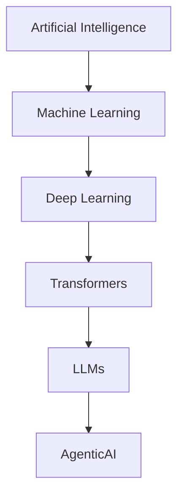

Deep Learning is the foundation upon which modern Generative AI and Agentic AI are built.

---

# Enterprise Architect Notes

Deep Learning is not a replacement for traditional Machine Learning.

Choose Deep Learning when:

- Large datasets are available.
- Data is unstructured (images, text, audio, video).
- Complex feature extraction is required.
- High predictive accuracy justifies increased computational cost.

Traditional Machine Learning is often preferable for structured business data such as:

- Loan approval
- Credit scoring
- Sales forecasting
- Inventory optimization

---

# 2. Why Deep Learning?

Traditional Machine Learning depends heavily on manually engineered features.

Example:

Fraud Detection

Manual Features:

- Transaction Amount
- Merchant Category
- Time of Day
- Device Type

A Deep Learning model can automatically discover complex relationships among these features.

---

## Traditional Machine Learning

```text
Raw Data
    ↓
Feature Engineering
    ↓
ML Algorithm
    ↓
Prediction
```

---

## Deep Learning

```text
Raw Data
    ↓
Deep Neural Network
    ↓
Prediction
```

The network learns intermediate representations automatically.

---

# Representation Learning

One of Deep Learning's biggest advantages is **representation learning**.

Instead of manually creating features, the network learns increasingly abstract representations.

Example (Image Classification):

```text
Pixels
   ↓
Edges
   ↓
Shapes
   ↓
Objects
   ↓
Dog
```

For language models:

```text
Characters
    ↓
Tokens
    ↓
Words
    ↓
Phrases
    ↓
Sentences
    ↓
Meaning
```

This capability enabled the rise of Transformers and Large Language Models.

---

# Common Misconception

❌ Deep Learning always outperforms Machine Learning.

Reality:

Deep Learning often requires:

- Large datasets
- High computational resources
- GPUs/TPUs
- Longer training times

For small structured datasets, traditional ML algorithms may perform equally well—or even better.

---

# 3. Machine Learning vs Deep Learning

| Machine Learning                    | Deep Learning                     |
| ----------------------------------- | --------------------------------- |
| Requires manual feature engineering | Learns features automatically     |
| Works well on structured data       | Excels with unstructured data     |
| Faster to train                     | Computationally expensive         |
| Easier to interpret                 | Often less interpretable          |
| Suitable for smaller datasets       | Benefits from very large datasets |

---

## Visual Comparison

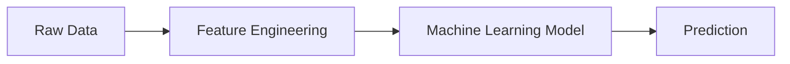

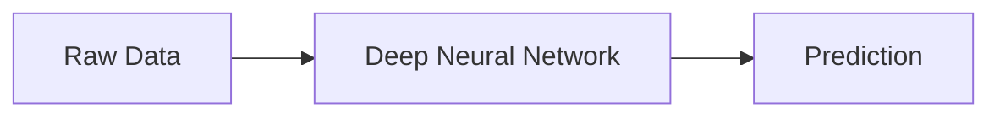

---

# 4. Biological Neuron

Artificial Neural Networks are inspired by the human brain.

A biological neuron consists of:

- Dendrites
- Cell Body
- Axon
- Synapses

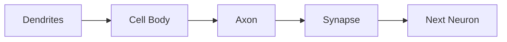

Biological neurons receive signals, process them, and transmit outputs to other neurons.

---

# Artificial Neuron

An artificial neuron mimics this behavior mathematically.

Inputs:

```
X1

X2

X3
```

Each input has an associated weight.

The neuron computes:

```
Weighted Sum

↓

Activation Function

↓

Output
```

---

## Artificial Neuron Diagram

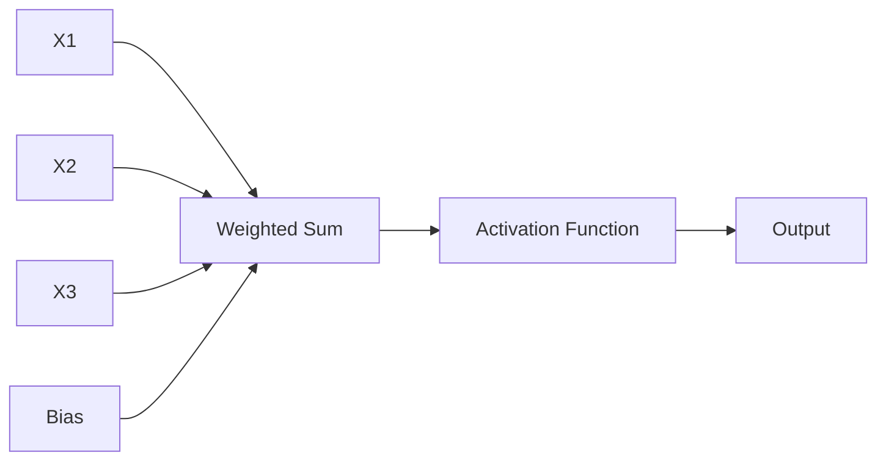

---

# Mathematical Representation

The neuron computes:

```
Output = Activation(
    W1X1 +
    W2X2 +
    W3X3 +
    Bias
)
```

Where:

- X = Input
- W = Weight
- Bias = Adjustable offset

---

# Enterprise Architect Notes

Although the mathematics appears simple, modern Large Language Models contain **billions of these parameters**, making distributed training and optimized inference essential for production deployment.

---

# 5. Perceptron

The **Perceptron**, introduced by Frank Rosenblatt in 1958, is the simplest neural network.

It consists of:

- Inputs
- Weights
- Bias
- Activation Function
- Output

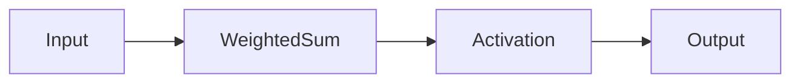

---

## Example

Suppose we are deciding whether to approve a loan.

Inputs:

- Income
- Credit Score
- Existing Debt

The perceptron combines these inputs and predicts:

- Approve
- Reject

---

## Limitation

A single perceptron can solve only **linearly separable problems**.

It cannot solve more complex relationships such as XOR.

This limitation led to the development of **multi-layer neural networks**.

---

# 6. Artificial Neural Networks (ANN)

Artificial Neural Networks consist of multiple interconnected neurons arranged in layers.

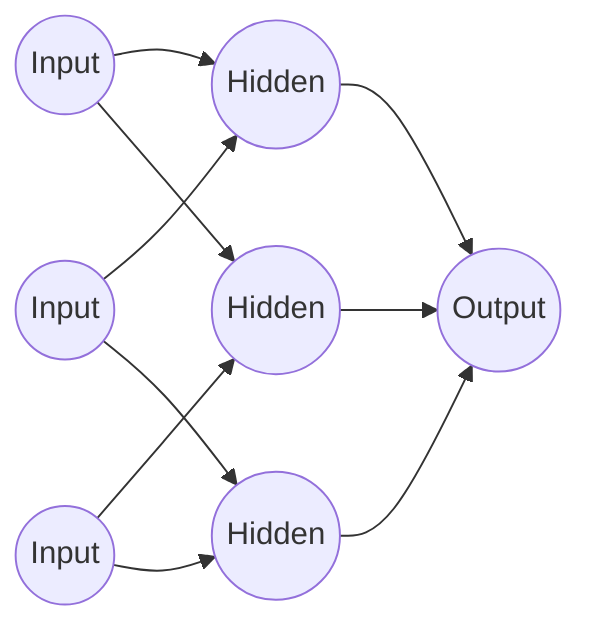

---

## Why Multiple Layers?

Each hidden layer learns increasingly complex patterns.

Example

Image Recognition

Layer 1

Edges

↓

Layer 2

Shapes

↓

Layer 3

Objects

↓

Layer 4

Categories

---

# Deep Neural Networks

When a neural network contains multiple hidden layers, it is called a **Deep Neural Network (DNN)**.

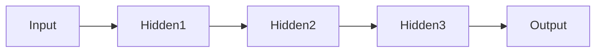

Modern LLMs contain **dozens to hundreds of transformer layers**, each learning progressively richer representations.

---

# 7. Neural Network Layers

Every ANN consists of three primary layer types.

---

## Input Layer

Receives raw input features.

Examples:

- Pixels
- Words
- Sensor readings
- Financial transactions

---

## Hidden Layers

Perform transformations and learn representations.

Deep Learning derives its name from having multiple hidden layers.

---

## Output Layer

Produces the final prediction.

Examples:

- Fraud / Genuine
- Positive / Negative
- House Price
- Next Word Token

---

## Layer Visualization

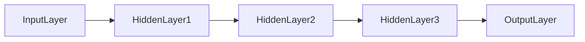

---

# 8. Weights and Bias

## Weights

Weights determine the importance of each input.

Large weight

↓

Greater influence

Small weight

↓

Less influence

During training, weights are continuously updated.

---

## Bias

Bias shifts the activation function.

Without bias, neural networks become significantly less expressive.

Every neuron usually has:

- Multiple weights
- One bias

---

## Weight Update Concept

```text
Prediction

↓

Error

↓

Adjust Weights

↓

Better Prediction
```

Training is essentially the process of learning optimal weights and biases.

---

# 9. Forward Propagation

Forward propagation is the process of passing information through the network to generate predictions.

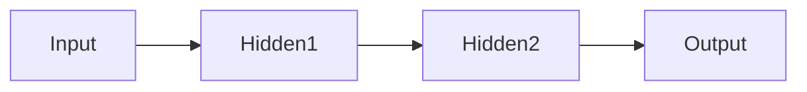

Steps:

1. Receive inputs.
2. Multiply by weights.
3. Add bias.
4. Apply activation function.
5. Pass output to next layer.
6. Repeat until final prediction.

---

## Enterprise Example

Customer applies for a loan.

↓

Input features

↓

Neural Network

↓

Risk Score

↓

Business Rules

↓

Approval Decision

Notice that the neural network generates a **risk score**, while deterministic business rules remain responsible for the final decision.

---

# Production Considerations

Neural network inference should be exposed through scalable APIs.

Typical deployment targets include:

- REST services
- gRPC services
- Kubernetes
- Azure Kubernetes Service (AKS)
- Amazon EKS
- Serverless inference endpoints

Inference systems should support:

- Horizontal scaling
- Auto-scaling
- Health checks
- Observability
- Model versioning

---

# Cross References

This chapter introduces the building blocks of neural networks.

The next chapters build directly on these concepts:

- **Chapter 4 – Transformers:** Introduces self-attention, positional encoding, encoder-decoder architectures, and why transformers replaced many RNN-based approaches.
- **Chapter 5 – Large Language Models:** Explores foundation models built using transformer architectures.
- **Chapter 15 – Retrieval-Augmented Generation (RAG):** Demonstrates how LLMs are augmented with enterprise knowledge.
- **Chapter 29 – Spring AI:** Shows how deep learning models and LLMs are integrated into enterprise Java applications.

---

---

# 10. Activation Functions

A neural network without an activation function behaves like a linear model, regardless of how many layers it contains.

Activation functions introduce **non-linearity**, enabling networks to learn complex relationships.

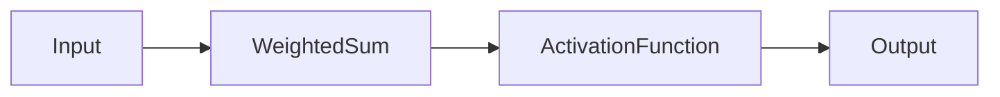

---

## Why Do We Need Activation Functions?

Suppose we are predicting fraud.

The relationship between:

- Transaction Amount
- Merchant
- Device
- Location
- Time

is highly non-linear.

Without activation functions, a neural network cannot model these complex interactions.

---

# Popular Activation Functions

| Function   | Typical Usage                  | Advantages               |
| ---------- | ------------------------------ | ------------------------ |
| Sigmoid    | Binary classification          | Probability output       |
| Tanh       | Hidden layers (older networks) | Zero-centered output     |
| ReLU       | Most hidden layers             | Fast and efficient       |
| Leaky ReLU | Deep networks                  | Reduces dead neurons     |
| GELU       | Transformers & LLMs            | Smooth activation        |
| Softmax    | Multi-class classification     | Probability distribution |

---

## Sigmoid

Produces outputs between:

```
0 and 1
```

Useful for:

- Binary Classification
- Logistic Regression
- Probability estimation

Equation

```
σ(x) = 1 / (1 + e^-x)
```

Advantages

- Simple
- Probabilistic interpretation

Disadvantages

- Vanishing gradients
- Slow convergence

---

## Tanh

Output Range

```
-1 to +1
```

Advantages

- Zero-centered
- Better than Sigmoid in many hidden layers

Disadvantages

- Still suffers from vanishing gradients

---

## ReLU (Rectified Linear Unit)

```
f(x) = max(0, x)
```

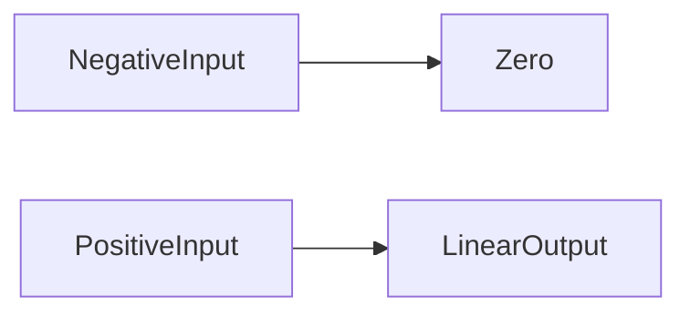

Advantages

- Computationally efficient
- Sparse activation
- Faster convergence
- Dominant choice in modern deep learning

Disadvantages

- Dead neuron problem

---

## Leaky ReLU

Allows small negative outputs.

Advantages

- Reduces dead neurons
- Better gradient flow

---

## GELU

Gaussian Error Linear Unit

Widely used in:

- BERT
- GPT
- Gemini
- Claude
- Llama

GELU provides smoother activation than ReLU.

---

## Softmax

Used in:

Multi-class classification.

Example

Image Classification

```
Dog      0.92

Cat      0.05

Horse    0.02

Bird     0.01
```

Probabilities sum to:

```
1.0
```

---

# Enterprise Architect Notes

Activation functions directly influence:

- Training stability
- Model convergence
- Computational efficiency
- Prediction quality

For enterprise applications, these choices are generally made by ML engineers or framework defaults, but architects should understand their trade-offs when evaluating model designs.

---

# 11. Loss Functions

A neural network must know how "wrong" its predictions are.

The loss function measures prediction error.

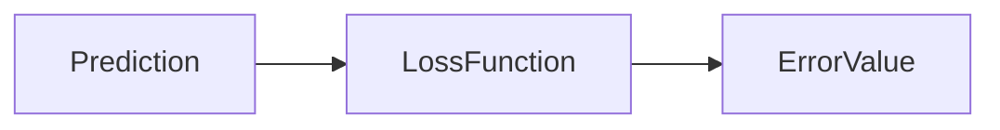

Lower loss

↓

Better model

---

## Regression Loss

Common choices

- Mean Squared Error (MSE)
- Mean Absolute Error (MAE)
- Huber Loss

---

## Classification Loss

Common choices

- Binary Cross Entropy
- Categorical Cross Entropy

These are standard choices for modern deep learning classification tasks.

---

# 12. Gradient Descent

Training attempts to minimize the loss function.

Gradient Descent is the optimization algorithm that updates model parameters.

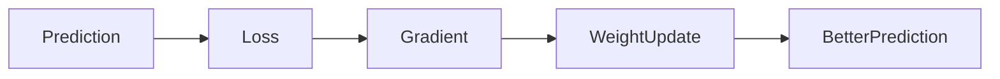

---

## Gradient Descent Process

1. Initialize weights
2. Make prediction
3. Calculate loss
4. Compute gradients
5. Update weights
6. Repeat

This process may execute millions of times during training.

---

## Learning Rate

The learning rate controls how much weights change during each update.

Too Small

- Slow training

Too Large

- Unstable training
- Divergence

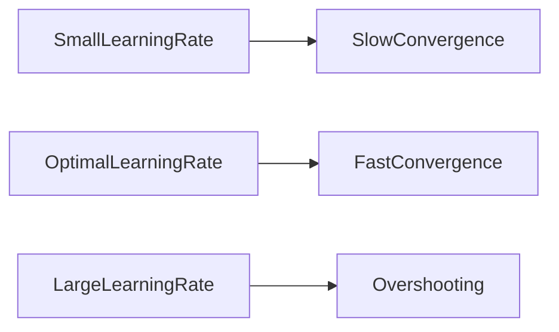

---

# 13. Backpropagation

Backpropagation is the algorithm that computes gradients for every weight in the network.

Without backpropagation, training deep neural networks would be impractical.

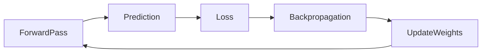

---

## Why Backpropagation Matters

Modern LLMs contain:

- Millions
- Billions
- Even trillions of parameters

Backpropagation efficiently updates all these parameters during training.

---

# Enterprise Architect Notes

Inference systems **do not perform backpropagation**.

Backpropagation occurs only during model training.

Production systems usually perform:

- Forward propagation
- Inference
- Logging
- Monitoring

Training typically happens offline on dedicated infrastructure.

---

# 14. Epochs, Batch Size, and Iterations

These three concepts are frequently confused.

---

## Epoch

One complete pass through the entire training dataset.

Example

Dataset

100,000 records

Epoch

Model processes all 100,000 records once.

---

## Batch Size

Number of records processed simultaneously.

Example

Dataset

100,000

Batch Size

100

Number of batches

1000

---

## Iteration

One weight update after processing a single batch.

Relationship

```
Iterations

×

Batch Size

=

Dataset Size
```

---

# Visual Representation

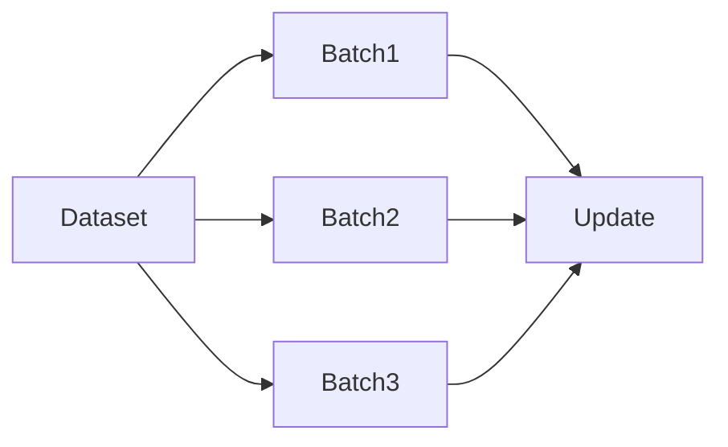

---

# 15. Vanishing and Exploding Gradients

Training deep networks introduces optimization challenges.

---

## Vanishing Gradient

Gradients become extremely small.

Result

- Slow learning
- Early layers stop learning

---

## Exploding Gradient

Gradients become excessively large.

Result

- Unstable training
- Numerical overflow

---

## Solutions

- ReLU
- Leaky ReLU
- Batch Normalization
- Residual Connections
- Gradient Clipping

These innovations enabled much deeper networks.

---

# 16. Convolutional Neural Networks (CNN)

CNNs are specialized neural networks for image processing.

Applications

- Medical imaging
- Face recognition
- Autonomous driving
- Manufacturing inspection

---

## CNN Architecture

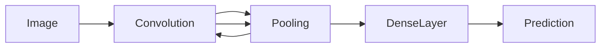

---

## Convolution Layer

Learns features such as:

- Edges
- Corners
- Textures
- Shapes

Unlike traditional ML, these features are learned automatically.

---

## Pooling Layer

Reduces image size while preserving important information.

Benefits

- Faster computation
- Reduced overfitting
- Better generalization

---

# Enterprise Examples

Healthcare

- Tumor detection
- X-ray classification

Retail

- Shelf monitoring

Manufacturing

- Defect detection

Security

- Face verification

---

# 17. Recurrent Neural Networks (RNN)

RNNs are designed for sequential data.

Examples

- Text
- Speech
- Time series
- Sensor streams

Unlike feedforward networks, RNNs maintain information from previous inputs.

---

## RNN Architecture

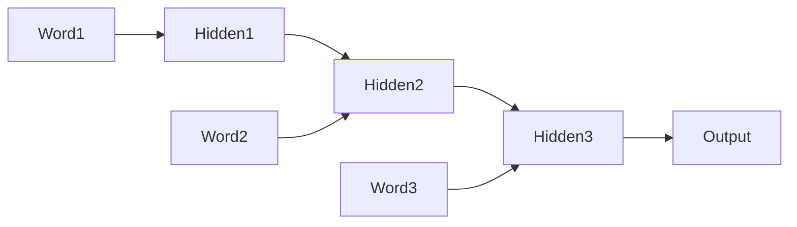

---

# Problem with RNNs

Long sequences become difficult to remember.

This limitation inspired:

- LSTM
- GRU

and eventually

- Transformers

---

# 18. Long Short-Term Memory (LSTM)

LSTMs improve traditional RNNs by introducing memory cells.

Advantages

- Better long-term memory
- Reduced vanishing gradients
- Improved sequence learning

Applications

- Speech recognition
- Translation
- Time-series forecasting

---

# 19. Gated Recurrent Unit (GRU)

GRU simplifies LSTM architecture.

Advantages

- Faster training
- Fewer parameters
- Comparable accuracy

Often preferred when computational resources are limited.

---

# RNN vs LSTM vs GRU

| Model | Memory    | Speed    | Complexity |
| ----- | --------- | -------- | ---------- |
| RNN   | Low       | Fast     | Simple     |
| LSTM  | Excellent | Moderate | High       |
| GRU   | Very Good | Faster   | Moderate   |

---

# 20. Autoencoders

Autoencoders learn compressed representations of data.

Applications

- Anomaly detection
- Image compression
- Feature extraction
- Noise reduction

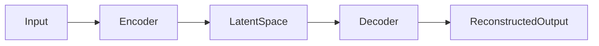

---

# 21. Transfer Learning

Training deep neural networks from scratch is expensive.

Instead,

reuse pre-trained models.

Example

ImageNet-trained CNN

↓

Fine-tune

↓

Medical image classifier

Benefits

- Faster training
- Less data required
- Higher accuracy
- Lower cost

Transfer learning is a key principle behind today's foundation models and LLM adaptation.

---

# Production Considerations

Enterprise deep learning workloads require:

- GPU acceleration
- Model versioning
- Automated deployment
- Hardware monitoring
- Cost optimization
- Reproducible training pipelines

Architectural considerations include:

- Batch vs real-time inference
- Model serving latency
- Memory footprint
- GPU utilization
- Horizontal scaling

---

# Common Misconceptions

### ❌ Deep Learning Understands Data Like Humans

Reality:

Deep learning models learn statistical representations—not human understanding.

---

### ❌ Bigger Networks Are Always Better

Larger models require:

- More data
- More compute
- Higher operational costs

Model size should match the business problem.

---

### ❌ CNNs Are Obsolete

Transformers dominate many domains, but CNNs remain highly effective for:

- Embedded systems
- Medical imaging
- Industrial vision
- Edge AI

---

# Principal Architect Interview Focus

Interviewers frequently ask:

- Why are activation functions necessary?
- Explain ReLU versus GELU.
- What is backpropagation?
- What happens if the learning rate is too high?
- Explain epochs, iterations, and batch size.
- Compare CNN, RNN, LSTM, and GRU.
- Why did Transformers replace many RNN-based architectures?
- When would transfer learning be preferred over training from scratch?

Senior candidates should connect these concepts to deployment architecture, scalability, and enterprise trade-offs rather than focusing solely on mathematical formulas.

---

# Cross References

This chapter prepares you for:

- **Chapter 4 – Transformers:** Self-attention overcomes the sequential limitations of RNNs and LSTMs.
- **Chapter 5 – Large Language Models:** Transformer-based foundation models trained at massive scale.
- **Chapter 15 – Retrieval-Augmented Generation (RAG):** Combining deep learning models with enterprise knowledge retrieval.
- **Chapter 29 – Spring AI:** Integrating deep learning and LLM capabilities into enterprise Java applications.

---

---

# 22. Representation Learning

One of the defining characteristics of Deep Learning is its ability to automatically learn **representations** from raw data.

Traditional Machine Learning relies heavily on manually engineered features.

Deep Learning progressively transforms raw input into increasingly meaningful representations.

```mermaid
flowchart LR

RawData

-->

LowLevelFeatures

-->

IntermediateFeatures

-->

HighLevelFeatures

-->

Prediction
```

---

## Example: Image Recognition

Imagine recognizing a cat in an image.

The neural network does not immediately recognize a "cat."

Instead, it gradually builds understanding.

```text
Pixels

↓

Edges

↓

Corners

↓

Shapes

↓

Eyes

↓

Face

↓

Cat
```

---

## Example: Natural Language

Large Language Models perform similar transformations.

```text
Characters

↓

Tokens

↓

Words

↓

Phrases

↓

Sentences

↓

Context

↓

Meaning
```

Every hidden layer learns increasingly abstract information.

---

# Why Representation Learning Matters

Representation learning eliminates much of the manual feature engineering traditionally required in Machine Learning.

Benefits include:

- Better generalization
- Reduced manual effort
- Improved accuracy
- Scalability across domains
- Transferability to new tasks

---

# Enterprise Architect Notes

Representation learning is one of the major reasons why foundation models are so powerful.

Instead of building a custom model for every business problem, organizations can adapt pre-trained representations through:

- Fine-tuning
- Prompt Engineering
- Retrieval-Augmented Generation (RAG)
- Adapters (LoRA/QLoRA)
- Tool Calling

This significantly reduces development time and infrastructure costs.

---

# 23. Foundation Models

A **Foundation Model** is a large deep learning model trained on enormous datasets that can be adapted to many downstream tasks.

Examples include:

- GPT
- Claude
- Gemini
- Llama
- Mistral

Instead of training from scratch for each task, organizations leverage these pre-trained models.

---

## Foundation Model Workflow

```mermaid
flowchart LR

MassiveTrainingData

-->

FoundationModel

-->

FineTuning

FineTuning --> Chatbot

FineTuning --> CodeAssistant

FineTuning --> MedicalAI

FineTuning --> BankingAssistant

FineTuning --> EnterpriseSearch
```

---

## Characteristics

Foundation models typically exhibit:

- General-purpose capabilities
- Transfer learning
- Few-shot learning
- Zero-shot learning
- Multi-task learning
- Instruction following

---

## Why They Changed AI

Previously:

```
One Model

↓

One Task
```

Today:

```
One Foundation Model

↓

Thousands of Tasks
```

This architectural shift transformed AI development.

---

# Cross Reference

Foundation Models are explored in detail in:

**Chapter 5 – Large Language Models**

---

# 24. Hardware for Deep Learning

Deep Learning training is computationally intensive.

CPU-based training becomes impractical for modern neural networks.

---

## CPU

Best suited for:

- Traditional applications
- Business logic
- Data preprocessing
- Small ML models

Advantages

- Widely available
- Low cost
- General purpose

---

## GPU

Graphics Processing Units are optimized for parallel computation.

Advantages

- Thousands of cores
- Matrix multiplication
- Vector operations
- Neural network acceleration

Common vendors:

- NVIDIA
- AMD
- Intel

---

## TPU

Tensor Processing Units are specialized AI accelerators.

Designed specifically for:

- Matrix operations
- Neural network training
- Large-scale inference

Most commonly used in Google Cloud.

---

# CPU vs GPU vs TPU

| Feature                | CPU          | GPU         | TPU               |
| ---------------------- | ------------ | ----------- | ----------------- |
| General Computing      | Excellent    | Limited     | Limited           |
| Parallel Processing    | Moderate     | Excellent   | Exceptional       |
| Deep Learning Training | Slow         | Fast        | Extremely Fast    |
| Cost                   | Low          | Medium–High | Cloud Specialized |
| Best For               | Applications | AI Training | Large AI Models   |

---

# Enterprise Architect Notes

Enterprise AI platforms commonly separate workloads:

- CPUs for APIs and orchestration
- GPUs for inference
- GPU clusters for training
- TPUs for hyperscale foundation model development

This separation optimizes both cost and performance.

---

# 25. Distributed Training

Modern Large Language Models contain billions—or even trillions—of parameters.

A single GPU cannot train these models efficiently.

Distributed training spreads computation across multiple GPUs or machines.

```mermaid
flowchart LR

TrainingDataset

-->

GPU1

TrainingDataset

-->

GPU2

TrainingDataset

-->

GPU3

TrainingDataset

-->

GPU4

GPU1 --> ParameterServer

GPU2 --> ParameterServer

GPU3 --> ParameterServer

GPU4 --> ParameterServer
```

---

## Benefits

- Faster training
- Larger models
- Better hardware utilization
- Reduced training time

---

## Distributed Training Strategies

### Data Parallelism

Each GPU processes a different subset of data while maintaining a copy of the model.

Suitable for:

- Large datasets
- Medium-sized models

---

### Model Parallelism

The model itself is divided across multiple GPUs.

Suitable for:

- Extremely large neural networks
- LLMs

---

### Pipeline Parallelism

Different model layers execute on different GPUs.

Useful for:

- Very deep transformer models

---

# 26. Mixed Precision Training

Training using full 32-bit precision is computationally expensive.

Mixed Precision Training combines:

- FP32
- FP16
- BF16

Advantages

- Faster training
- Lower memory usage
- Reduced infrastructure cost

Supported by:

- NVIDIA Tensor Cores
- AMD AI Accelerators
- Modern TPUs

---

# 27. Deep Learning Lifecycle

Enterprise Deep Learning extends the traditional Machine Learning lifecycle.

```mermaid
flowchart LR

BusinessProblem

-->

DataCollection

-->

DataPreparation

-->

Training

-->

Validation

-->

HyperparameterTuning

-->

Deployment

-->

Monitoring

-->

Retraining
```

---

## Additional Deep Learning Challenges

Compared to traditional ML:

- Larger datasets
- Longer training times
- Specialized hardware
- Model optimization
- High infrastructure cost

---

# 28. Enterprise Deep Learning Architecture

Deep Learning is rarely deployed as a standalone model.

Instead, it forms part of a broader enterprise architecture.

```mermaid
flowchart LR

Users

-->

Application

-->

APIGateway

-->

Authentication

-->

InferenceService

InferenceService --> ModelRegistry

InferenceService --> GPUCluster

InferenceService --> FeatureStore

InferenceService --> Monitoring

Monitoring --> Dashboard
```

---

## Components

### API Gateway

Provides:

- Authentication
- Rate limiting
- Logging
- Request routing

---

### Inference Service

Responsible for:

- Model loading
- Prediction
- Response formatting
- Version management

---

### GPU Cluster

Executes deep learning inference.

Supports:

- Auto-scaling
- Load balancing
- High availability

---

### Model Registry

Stores:

- Model versions
- Metadata
- Evaluation metrics
- Deployment status

---

### Monitoring

Tracks:

- Latency
- Accuracy
- Throughput
- Errors
- Drift

---

# Production Considerations

Enterprise deployments should include:

- Canary releases
- Blue-green deployments
- Rollback support
- Versioned models
- Health probes
- Auto-scaling
- GPU utilization monitoring
- Cost dashboards

---

# 29. MLOps for Deep Learning

Deep Learning projects benefit significantly from MLOps practices.

```mermaid
flowchart LR

SourceCode

-->

CI

-->

TrainingPipeline

-->

Evaluation

-->

ModelRegistry

-->

Deployment

-->

Production

-->

Monitoring

-->

Retraining
```

---

## Key Components

- Source control
- Dataset versioning
- Experiment tracking
- Model registry
- Automated deployment
- Continuous monitoring
- Automated retraining

---

## Experiment Tracking

Each training run should capture:

- Dataset version
- Hyperparameters
- Learning rate
- Optimizer
- Accuracy
- Loss
- Training duration
- Hardware configuration

This enables reproducibility and simplifies debugging.

---

# 30. Monitoring Deep Learning Systems

Monitoring extends beyond infrastructure metrics.

Important categories include:

### Infrastructure

- CPU utilization
- GPU utilization
- Memory consumption
- Network throughput

---

### Model

- Accuracy
- Precision
- Recall
- F1 Score
- Drift

---

### Operational

- API latency
- Requests per second
- Error rate
- Availability

---

### Business

- Customer satisfaction
- Fraud detection rate
- Revenue impact
- Conversion rate

---

# 31. Security Considerations

Deep Learning introduces unique security risks.

### Model Theft

Attackers may attempt to copy trained models.

Mitigations:

- Authentication
- Authorization
- Rate limiting
- Encrypted model storage

---

### Data Poisoning

Malicious actors insert corrupted training data.

Mitigations:

- Data validation
- Data lineage
- Human approval
- Dataset versioning

---

### Adversarial Attacks

Small input modifications can produce incorrect predictions.

Examples:

- Modified traffic signs
- Altered medical images
- Manipulated documents

Mitigations:

- Robust training
- Adversarial testing
- Input validation

---

# Cross References

The concepts in this section provide the operational foundation for later chapters:

- **Chapter 4 – Transformers:** Explains the architecture that replaced many CNN and RNN use cases for language understanding.
- **Chapter 5 – Large Language Models:** Covers foundation model training, scaling laws, and inference optimization.
- **Chapter 29 – Spring AI:** Demonstrates enterprise deployment of foundation models within Java applications.
- **Chapter 38 – AI Security:** Expands on adversarial attacks, model theft, prompt injection, and enterprise AI security controls.

---

---

# 32. AI Governance for Deep Learning

Enterprise Deep Learning systems must be governed throughout their lifecycle.

Governance ensures that models are:

- Reliable
- Explainable
- Secure
- Auditable
- Compliant
- Ethical

Governance is not a one-time activity—it is a continuous process.

```mermaid
flowchart TD

BusinessGoals

-->

Governance

Governance --> Policies

Governance --> Compliance

Governance --> RiskManagement

Governance --> Security

Governance --> Monitoring

Monitoring --> Audit

Audit --> ContinuousImprovement
```

---

## Governance Principles

- Transparency
- Accountability
- Human Oversight
- Fairness
- Privacy
- Traceability
- Explainability

---

## Enterprise Governance Checklist

| Area               | Recommendation                    |
| ------------------ | --------------------------------- |
| Model Versioning   | Mandatory                         |
| Dataset Versioning | Mandatory                         |
| Audit Logs         | Required                          |
| Human Approval     | High-risk decisions               |
| Security Reviews   | Every release                     |
| Explainability     | Required for regulated industries |
| Monitoring         | Continuous                        |
| Rollback Strategy  | Mandatory                         |

---

# Enterprise Architect Notes

Governance should be designed into the platform—not added after deployment.

Successful enterprise AI platforms integrate governance into:

- CI/CD pipelines
- Model Registry
- Deployment workflows
- Monitoring dashboards
- Approval processes

---

# 33. Explainable AI (XAI)

Many Deep Learning models are considered "black boxes."

However, industries such as banking and healthcare require explanations for automated decisions.

Examples:

- Why was a loan rejected?
- Why was a medical diagnosis predicted?
- Why was a transaction flagged as fraud?

---

## Common Explainability Techniques

- Feature Importance
- SHAP Values
- LIME
- Saliency Maps
- Grad-CAM (Computer Vision)

---

## Enterprise Benefits

- Regulatory compliance
- Increased trust
- Easier debugging
- Better model governance

---

# 34. Enterprise Deep Learning Design Patterns

## Pattern 1 – AI-Assisted Decision Making

AI provides recommendations while business rules and humans make final decisions.

```mermaid
flowchart LR

CustomerRequest

-->

BusinessApplication

-->

DeepLearningModel

-->

Prediction

Prediction --> BusinessRules

BusinessRules --> HumanApproval

HumanApproval --> FinalDecision
```

Recommended for:

- Banking
- Insurance
- Healthcare
- Government

---

## Pattern 2 – Human-in-the-Loop (HITL)

```mermaid
flowchart LR

Prediction

-->

ConfidenceScore

ConfidenceScore -->|High| AutomaticApproval

ConfidenceScore -->|Low| HumanReview

HumanReview --> FinalDecision
```

Benefits

- Improved reliability
- Reduced business risk
- Better regulatory compliance

---

## Pattern 3 – Hybrid AI

Combines deterministic business rules with Deep Learning.

```mermaid
flowchart LR

BusinessRules

-->

DecisionEngine

DeepLearningPrediction

-->

DecisionEngine

DecisionEngine

-->

FinalDecision
```

This architecture is widely used in enterprise systems because it balances flexibility with predictability.

---

# Production Considerations

Production-ready Deep Learning systems should provide:

- High availability
- Auto-scaling
- Disaster recovery
- Canary deployments
- Blue-Green deployments
- API versioning
- GPU utilization monitoring
- Cost monitoring
- Rate limiting
- Observability
- Secure secrets management

---

## Reliability Checklist

- Health checks
- Retry mechanisms
- Circuit breakers
- Request timeouts
- Graceful degradation
- Model fallback
- Automatic rollback

---

# 35. Common Pitfalls

## ❌ More Layers Always Mean Better Accuracy

Reality:

Adding layers can increase:

- Overfitting
- Training time
- Infrastructure cost

Model complexity should match the business problem.

---

## ❌ Bigger Datasets Always Improve Results

Poor-quality data often produces poor models.

Data quality is generally more important than data quantity.

---

## ❌ Deep Learning Eliminates Feature Engineering

Deep Learning reduces manual feature engineering, but engineers still perform:

- Data cleaning
- Normalization
- Tokenization
- Data augmentation
- Feature selection (where appropriate)

---

## ❌ Training Ends When Accuracy Is High

Enterprise AI is an ongoing operational system.

After deployment:

- Monitor
- Evaluate
- Retrain
- Govern
- Improve

---

## ❌ AI Replaces Business Logic

Business rules remain essential.

Deep Learning complements—not replaces—enterprise decision-making.

---

# Enterprise Architect Notes

Separate responsibilities into independent services.

```text
Client

↓

API Gateway

↓

Authentication

↓

Inference Service

↓

Model Registry

↓

Monitoring

↓

Governance

↓

Audit
```

Benefits

- Independent scaling
- Better security
- Easier maintenance
- Team ownership
- Faster deployments

---

# Best Practices

## Architecture

- Separate training from inference.
- Deploy models behind APIs.
- Version every model.
- Keep inference stateless where possible.
- Externalize configuration.

---

## Data

- Validate datasets before training.
- Track dataset lineage.
- Store dataset versions.
- Monitor data quality continuously.

---

## Models

- Track experiments.
- Measure latency as well as accuracy.
- Continuously monitor drift.
- Plan for regular retraining.

---

## Operations

- Automate CI/CD pipelines.
- Use Infrastructure as Code.
- Monitor GPU utilization.
- Enable centralized logging.
- Collect distributed traces.

---

## Security

- Encrypt model artifacts.
- Protect APIs with authentication and authorization.
- Apply rate limiting.
- Scan for vulnerabilities.
- Review prompts and external integrations.

---

# Principal Architect Interview Focus

Senior and Principal Architect interviews emphasize architectural reasoning rather than mathematical derivations.

Common interview questions include:

### Fundamentals

- What distinguishes Deep Learning from Machine Learning?
- Why are hidden layers important?
- Explain forward propagation.
- Explain backpropagation.
- Why are activation functions necessary?

---

### Model Architecture

- Compare ANN, CNN, RNN, LSTM, and GRU.
- When should CNNs be preferred?
- Why were Transformers introduced?
- What is transfer learning?

---

### Enterprise Design

- Design a scalable inference platform.
- How would you deploy multiple model versions?
- How would you reduce inference latency?
- How would you monitor production models?

---

### Operations

- Explain MLOps.
- How do you detect model drift?
- What metrics should be monitored?
- Describe rollback strategies.

---

### Governance

- How would you secure model APIs?
- How would you implement Human-in-the-Loop workflows?
- What governance controls are required?
- Explain AI explainability.

---

# Key Takeaways

- Deep Learning is a subset of Machine Learning built on multi-layer neural networks.
- Neural networks learn representations automatically, reducing manual feature engineering.
- Activation functions introduce non-linearity and enable complex learning.
- Training relies on forward propagation, loss calculation, gradient descent, and backpropagation.
- CNNs excel in vision tasks, while RNNs, LSTMs, and GRUs address sequential data.
- Foundation Models leverage transfer learning and representation learning at scale.
- Enterprise Deep Learning requires GPU acceleration, MLOps, governance, monitoring, and security.
- Deep Learning forms the technological foundation for modern Transformers and Large Language Models.

---

# Chapter Summary

In this chapter, you learned:

- The motivation behind Deep Learning.
- Biological inspiration and artificial neurons.
- Perceptrons and Artificial Neural Networks.
- Layers, weights, biases, and forward propagation.
- Activation functions and optimization.
- Gradient descent and backpropagation.
- CNNs, RNNs, LSTMs, and GRUs.
- Representation learning and transfer learning.
- Foundation Models and modern AI infrastructure.
- Distributed training and mixed precision.
- Enterprise deployment architectures.
- MLOps, monitoring, governance, and security.
- Enterprise design patterns and production best practices.

These concepts provide the conceptual bridge to the Transformer architecture, which revolutionized Natural Language Processing and enabled today's Large Language Models.

---

# Cross References

Continue with:

- **Chapter 4 – Transformers**  
  Self-attention, positional encoding, encoder-decoder architecture, multi-head attention, and why Transformers replaced RNNs.

- **Chapter 5 – Large Language Models**  
  Scaling laws, tokenization, embeddings, instruction tuning, RLHF, inference, and foundation models.

- **Chapter 15 – Retrieval-Augmented Generation (RAG)**  
  Enhancing LLMs with enterprise knowledge retrieval.

- **Chapter 17 – Vector Databases**  
  Embeddings, semantic search, similarity metrics, and retrieval.

- **Chapter 29 – Spring AI**  
  Enterprise integration of foundation models using Java and Spring Boot.

- **Chapter 38 – AI Security**  
  Adversarial attacks, model protection, prompt injection, and governance.

---

# Interview Questions

## Fundamentals

1. What is Deep Learning?
2. How is Deep Learning different from Machine Learning?
3. Explain an artificial neuron.
4. What is a perceptron?
5. Why are hidden layers required?

---

## Neural Networks

6. What are weights and biases?
7. Explain forward propagation.
8. Explain backpropagation.
9. What is an activation function?
10. Compare ReLU, Sigmoid, Tanh, and GELU.

---

## Optimization

11. What is gradient descent?
12. What is a learning rate?
13. Explain epochs, iterations, and batch size.
14. What are vanishing gradients?
15. What are exploding gradients?

---

## Architectures

16. Compare ANN, CNN, RNN, LSTM, and GRU.
17. What is transfer learning?
18. Explain representation learning.
19. What are foundation models?
20. Why did Transformers replace many RNN-based systems?

---

## Enterprise

21. How would you deploy a Deep Learning model in production?
22. What infrastructure is required for large-scale inference?
23. How would you monitor model performance?
24. Explain MLOps for Deep Learning.
25. How would you implement governance and explainability?

---

# References

## Books

- _Deep Learning_ — Ian Goodfellow, Yoshua Bengio, Aaron Courville
- _Hands-On Machine Learning with Scikit-Learn, Keras & TensorFlow_ — Aurélien Géron
- _Designing Machine Learning Systems_ — Chip Huyen
- _Machine Learning Engineering_ — Andriy Burkov

---

## Landmark Research

- Gradient-Based Learning Applied to Document Recognition (LeCun et al.)
- ImageNet Classification with Deep Convolutional Neural Networks (AlexNet)
- Deep Residual Learning for Image Recognition (ResNet)
- Attention Is All You Need (Transformer)

---

## Industry Resources

- NVIDIA Deep Learning Documentation
- Google AI Research
- Microsoft AI Architecture Center
- AWS Machine Learning Documentation

---

# Next Chapter

➡ **Chapter 4 – Transformers**

In the next chapter, you'll learn:

- Why RNNs reached their limits
- The Transformer architecture
- Self-attention mechanism
- Query, Key, and Value vectors
- Multi-head attention
- Positional encoding
- Encoder-decoder architecture
- Training Transformers
- Scaling Transformer models
- Enterprise Transformer deployments
- How Transformers became the foundation of all modern Large Language Models

---
