# Chapter 4 – Transformers

> **Part I – Transformer Fundamentals**
>
> **Chapter 4**

---

# Learning Objectives

After completing this chapter, you will be able to:

- Explain why Transformers were invented.
- Understand the limitations of RNNs and LSTMs.
- Explain the Encoder-Decoder architecture.
- Understand the Attention mechanism.
- Explain Self-Attention.
- Understand Query, Key, and Value (QKV).
- Explain Scaled Dot Product Attention.
- Understand Multi-Head Attention.
- Explain Positional Encoding.
- Understand why Transformers became the foundation of modern AI.
- Prepare for Large Language Models.

---

# Table of Contents

1. Introduction
2. Evolution of NLP
3. Why Transformers?
4. Problems with RNNs
5. Long-Term Dependency Problem
6. Transformer Solution
7. Encoder-Decoder Architecture
8. Attention Mechanism
9. Self-Attention
10. Query, Key and Value
11. Scaled Dot Product Attention
12. Multi-Head Attention
13. Positional Encoding

---

# 1. Introduction

The **Transformer** is one of the most influential innovations in Artificial Intelligence.

Introduced in **2017** through the landmark research paper:

> **Attention Is All You Need**

the Transformer architecture fundamentally changed Natural Language Processing (NLP) and later enabled:

- GPT
- BERT
- Llama
- Claude
- Gemini
- Mistral
- DeepSeek
- Qwen

Today, nearly every modern Large Language Model (LLM) is built upon the Transformer architecture.

---

## Evolution of AI

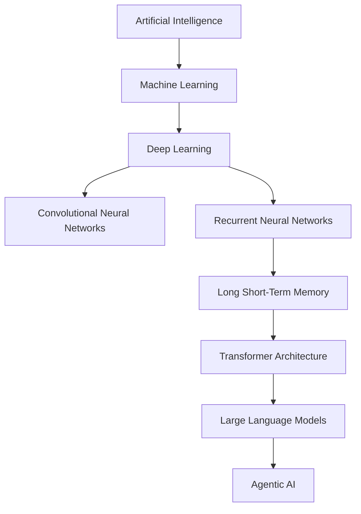

---

# Enterprise Architect Notes

> **Architectural Principle**

Products change rapidly.

Architectures remain relevant for years.

Understanding **Transformer Architecture** enables you to understand:

- GPT
- Claude
- Gemini
- Llama
- Mistral
- DeepSeek
- Future Foundation Models

Instead of memorizing individual AI products, focus on understanding the architectural principles.

---

# 2. Evolution of Natural Language Processing

Natural Language Processing has evolved through several generations.

---

## Rule-Based Systems

Early NLP systems relied entirely on manually written rules.

```
Grammar Rules

↓

Expert System

↓

Output
```

Advantages

- Deterministic
- Explainable

Limitations

- Difficult to scale
- Poor language understanding
- Required continuous manual maintenance

---

## Statistical NLP

Later systems used statistical methods.

```
Text

↓

Statistical Features

↓

Classifier

↓

Prediction
```

Examples

- Naïve Bayes
- Hidden Markov Models
- Conditional Random Fields

---

## Machine Learning Era

Machine Learning introduced automatic pattern recognition.

```
Raw Text

↓

Feature Engineering

↓

Machine Learning

↓

Prediction
```

Engineers manually created:

- TF-IDF
- N-Grams
- Word Counts

---

## Deep Learning Era

Neural Networks reduced manual feature engineering.

```
Words

↓

Embeddings

↓

RNN / LSTM

↓

Prediction
```

---

## Transformer Era

Transformers process entire sequences simultaneously.

```
Sentence

↓

Transformer

↓

Contextual Representation

↓

Prediction
```

---

## NLP Evolution Timeline

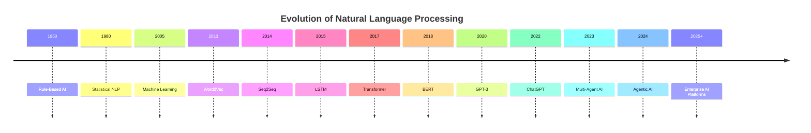

---

# Common Misconception

❌ Transformers completely replaced every previous Deep Learning model.

Reality

CNNs remain highly effective for:

- Computer Vision
- Image Processing
- Edge AI

RNNs and LSTMs remain useful for:

- Small embedded systems
- Time-series forecasting
- Certain streaming applications

Transformers dominate modern NLP because of their scalability and contextual understanding.

---

# 3. Why Were Transformers Invented?

Before Transformers, NLP relied primarily on:

- RNN
- LSTM
- GRU

These architectures processed text sequentially.

Example

```
I

↓

love

↓

Artificial

↓

Intelligence
```

Each word must wait for the previous word.

Problems included:

- Slow execution
- Limited parallelism
- Long-term dependency issues
- Information bottlenecks

Researchers asked:

> **Can all words be processed simultaneously?**

The answer became the **Transformer**.

---

## Sequential Processing

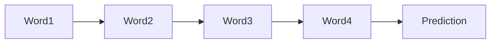

---

## Parallel Processing

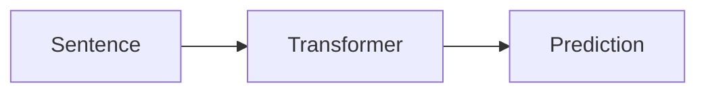

All tokens are processed together.

---

# Enterprise Architect Notes

Parallel processing enabled the industry to train:

- Billion-parameter models
- Trillion-token datasets
- Massive distributed GPU clusters

Without Transformers, today's Large Language Models would be computationally impractical.

---

# 4. Problems with RNNs

Consider the sentence:

> **The book that I bought yesterday from the bookstore in Pune was excellent.**

To understand:

```
excellent
```

the model must remember:

```
book
```

many words earlier.

This becomes increasingly difficult as sentence length grows.

---

## RNN Processing


Information must pass through every intermediate word.

---

## Problems

- Sequential execution
- Slow training
- Difficult parallelization
- Vanishing gradients
- Information loss
- Limited context window

---

# 5. Long-Term Dependency Problem

Language often requires understanding relationships between distant words.

Example

> **The CEO of the company that acquired the startup last year announced...**

To predict:

```
announced
```

the model must remember:

```
CEO
```

from many tokens earlier.

---

## Long Dependency Visualization


Longer sequences increase memory challenges for RNNs.

---

# Why This Matters

Documents often contain:

- Hundreds of words
- Thousands of words
- Tens of thousands of tokens

Traditional sequence models struggle with these long contexts.

---

# 6. Transformer Solution

Transformers eliminate sequential processing.

Every token can directly attend to every other token.

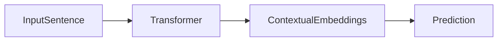

Advantages

- Parallel execution
- Better context understanding
- Improved scalability
- Faster training
- Better long-range dependencies

---

# Enterprise Benefits

Transformers enable:

- Large-scale translation
- Document summarization
- Code generation
- Conversational AI
- Enterprise Search
- Knowledge Assistants
- Agentic AI

---

# 7. Encoder–Decoder Architecture

The original Transformer consists of two major components.

- Encoder
- Decoder

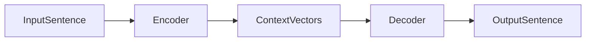

---

## Encoder Responsibilities

The Encoder:

- Reads the input sequence
- Understands context
- Produces contextual embeddings
- Captures semantic meaning

---

## Decoder Responsibilities

The Decoder:

- Generates output
- Predicts one token at a time
- Uses encoder context
- Uses previously generated tokens

---

## High-Level Architecture

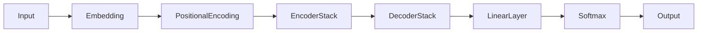

---

# Enterprise Architect Notes

Modern LLMs differ from the original Transformer.

Examples

| Model | Architecture      |
| ----- | ----------------- |
| BERT  | Encoder Only      |
| GPT   | Decoder Only      |
| T5    | Encoder + Decoder |
| BART  | Encoder + Decoder |

These architectural differences determine how models are trained and what tasks they perform best.

---

# 8. Attention Mechanism

The most revolutionary idea introduced by Transformers is **Attention**.

Humans naturally focus on important words.

Transformers mimic this behavior.

Example

```
The cat sat on the mat.
```

When processing:

```
sat
```

the model pays greater attention to:

- cat
- mat

than to less relevant words.

---

## Attention Flow

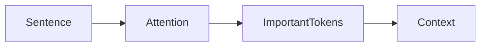

---

# Why Attention Matters

Without attention:

Every word contributes equally.

With attention:

Important words contribute more.

This dynamic weighting dramatically improves language understanding.

---

# 9. Self-Attention

Self-Attention allows every token to examine every other token.

Example

```
The animal didn't cross the street because it was tired.
```

To understand:

```
it
```

the model must determine whether:

- animal
- street

is the correct reference.

Self-Attention makes this possible.

---

## Self-Attention Visualization

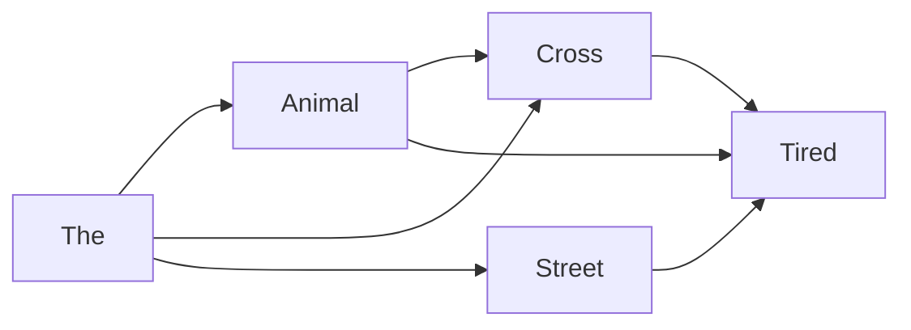

Every token can communicate with every other token.

---

# Enterprise Example

Customer Support

Sentence

```
My card was blocked after I travelled to Singapore.
```

The model associates:

- card
- blocked
- travelled
- Singapore

to understand potential fraud.

---

# 10. Query, Key and Value (QKV)

Self-Attention uses three learned vectors.

- Query (Q)
- Key (K)
- Value (V)

Each token generates its own Q, K and V vectors.

---

## Intuition

| Vector | Purpose                               |
| ------ | ------------------------------------- |
| Query  | What information am I searching for?  |
| Key    | What information do I contain?        |
| Value  | What information should I contribute? |

---

## QKV Generation

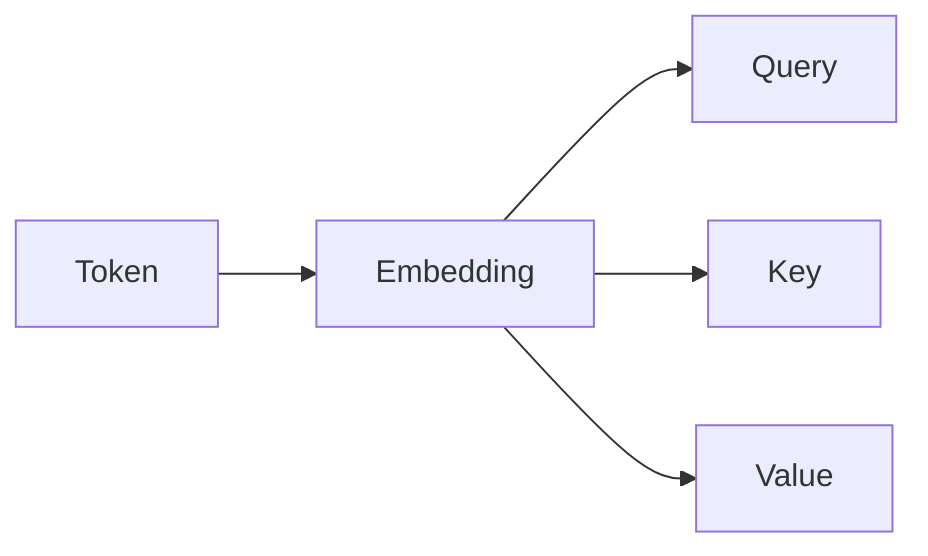

---

# Example

Sentence

```
The dog chased the ball.
```

For the token:

```
dog
```

Query asks:

> Which other words are important to me?

Other tokens provide:

- Keys
- Values

The Attention mechanism determines the relevance.

---

# 11. Scaled Dot Product Attention

The Self-Attention algorithm follows these steps:

1. Compute Query × Key similarity.
2. Scale the scores.
3. Apply Softmax.
4. Generate attention weights.
5. Weight the Values.
6. Produce contextual output.

---

## Workflow

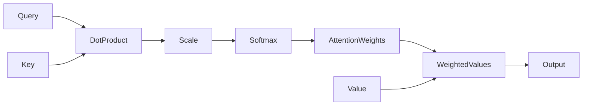

---

## Why Scaling?

Without scaling,

large vector dimensions produce extremely large values,

making Softmax unstable.

Scaling improves:

- Numerical stability
- Faster convergence
- Better training

---

# 12. Multi-Head Attention

One attention calculation captures only one relationship.

Multiple Attention Heads allow the model to learn several relationships simultaneously.

Examples

Head 1

- Grammar

Head 2

- Subject–Verb agreement

Head 3

- Semantic meaning

Head 4

- Long-distance dependencies

---

## Multi-Head Attention

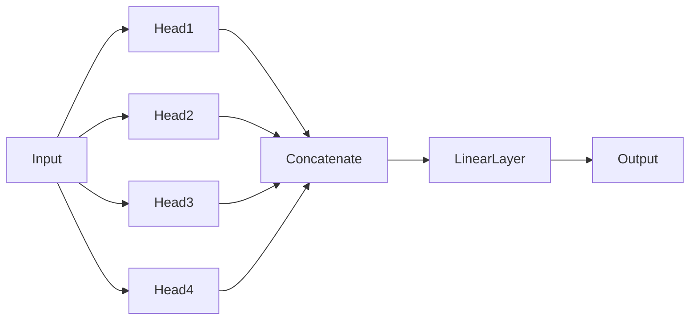

---

# Enterprise Architect Notes

Different Attention Heads often specialize in different linguistic or semantic relationships.

Collectively, they produce a richer contextual understanding than a single attention mechanism.

---

# 13. Positional Encoding

Unlike RNNs,

Transformers process all tokens simultaneously.

Therefore,

they need an explicit way to represent word order.

Positional Encoding injects sequence information into token embeddings.

---

## Example

Sentence

```
I love AI
```

Positions

```
0

1

2
```

Position vectors are mathematically generated and added to token embeddings.

---

## Positional Encoding

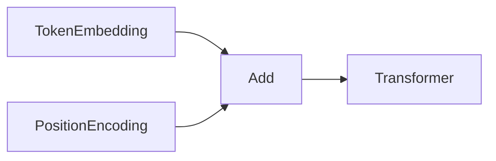

---

# Why Position Matters

Without positional encoding,

the model would treat:

```
Dog bites man
```

and

```
Man bites dog
```

as identical collections of words.

Position preserves sentence meaning.

---

# Production Considerations

Enterprise Transformer deployments require careful planning.

Architects should evaluate:

- GPU memory utilization
- Context window limits
- Token throughput
- Parallel inference
- Batch inference
- Streaming inference
- Autoscaling
- Cost optimization
- Observability
- Model versioning

These topics will be expanded in later chapters.

---

# Cross References

The concepts introduced in this chapter directly support:

- **Chapter 5 – Large Language Models**
- **Chapter 15 – Retrieval-Augmented Generation (RAG)**
- **Chapter 17 – Vector Databases**
- **Chapter 18 – Embeddings**
- **Chapter 29 – Spring AI**

---

---

# 14. Inside the Transformer Encoder

The **Encoder** is responsible for understanding the input sequence and generating contextual representations that capture the meaning of every token.

Unlike RNNs, the encoder processes all tokens **simultaneously**, allowing highly parallel computation.

---

## High-Level Encoder Architecture

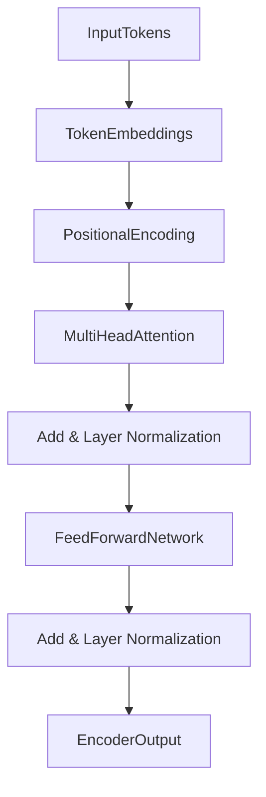

---

## Responsibilities of the Encoder

The encoder performs several key tasks:

- Understands token relationships
- Learns contextual meaning
- Generates contextual embeddings
- Captures long-range dependencies
- Produces outputs for downstream layers

The encoder does **not** generate text.

Instead, it creates rich contextual representations.

---

# Enterprise Architect Notes

Think of the Encoder as an **understanding engine**.

It transforms raw text into semantic representations that can later be consumed by:

- Search systems
- Classification models
- Recommendation engines
- RAG pipelines
- Decoder models

---

# 15. Inside the Transformer Decoder

The Decoder generates output tokens one token at a time.

Unlike the encoder, the decoder performs **autoregressive generation**.

Example

```
Input

↓

Hello

↓

Hello World

↓

Hello World!
```

Each new token depends on previously generated tokens.

---

## Decoder Architecture

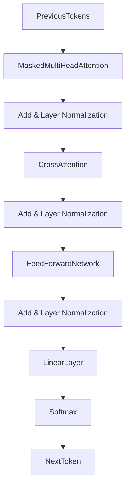

---

## Decoder Responsibilities

The decoder:

- Generates text
- Predicts the next token
- Uses previous outputs
- Uses encoder context (encoder-decoder models)

---

# Decoder-Only Models

Many modern LLMs use **Decoder-Only** architectures.

Examples

| Model   | Architecture |
| ------- | ------------ |
| GPT     | Decoder Only |
| Llama   | Decoder Only |
| Claude  | Decoder Only |
| Gemini  | Decoder Only |
| Mistral | Decoder Only |

These models excel at text generation.

---

# 16. Feed Forward Network (FFN)

Each Transformer layer contains a Feed Forward Network after the attention mechanism.

The FFN processes each token independently.

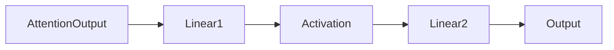

---

## Purpose

The FFN:

- Learns higher-level representations
- Increases model capacity
- Introduces additional non-linearity
- Refines contextual embeddings

---

# 17. Residual Connections

Training very deep neural networks becomes difficult because information can degrade across many layers.

Residual connections solve this problem.

Instead of learning an entirely new representation, each layer learns only the difference (residual).

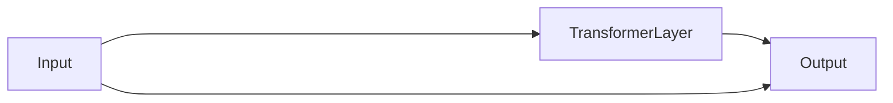

The shortcut connection allows gradients to flow more effectively.

---

## Benefits

- Easier optimization
- Faster convergence
- Stable deep networks
- Better gradient flow

Residual connections enabled Transformers with dozens or hundreds of layers.

---

# 18. Layer Normalization

Training deep networks can become unstable because activations vary significantly.

Layer Normalization stabilizes these activations.

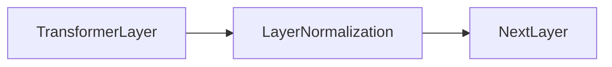

---

## Benefits

- Stable gradients
- Faster convergence
- Improved training
- Better numerical stability

Layer Normalization is applied after:

- Multi-Head Attention
- Feed Forward Network

---

# Enterprise Architect Notes

Residual Connections and Layer Normalization are architectural innovations that make extremely deep Transformer models practical.

Without them, today's Large Language Models would be much harder to train.

---

# 19. Complete Transformer Block

A Transformer layer combines multiple components.

```mermaid
flowchart TD

Input

-->

MultiHeadAttention

-->

AddNorm1["Add & Norm"]

-->

FeedForwardNetwork

-->

AddNorm2["Add & Norm"]

-->

Output
```

Modern LLMs stack dozens—or even hundreds—of these blocks.

---

# 20. Transformer Stack

Multiple Transformer layers are stacked together.

```mermaid
flowchart TD

Input

-->

TransformerLayer1

-->

TransformerLayer2

-->

TransformerLayer3

-->

TransformerLayer4

-->

TransformerLayerN

-->

Output
```

Each layer learns progressively richer representations.

---

# Representation Growth

Example

```
Characters

↓

Tokens

↓

Words

↓

Phrases

↓

Sentences

↓

Context

↓

Meaning
```

This hierarchical learning enables sophisticated language understanding.

---

# 21. Tokenization

Computers do not understand raw text.

Text must first be converted into **tokens**.

Example

Sentence

```
Artificial Intelligence is amazing.
```

Possible tokens

```
Artificial

Intelligence

is

amazing

.
```

Some models split into even smaller subwords.

---

## Tokenization Pipeline

```mermaid
flowchart LR

RawText

-->

Tokenizer

-->

Tokens

-->

Embeddings
```

---

## Popular Tokenizers

- Byte Pair Encoding (BPE)
- WordPiece
- SentencePiece
- Unigram

Different models use different tokenization strategies.

---

# Enterprise Considerations

Tokenization directly impacts:

- Context window
- Cost
- Latency
- Memory usage

Longer inputs generate more tokens and therefore increase inference cost.

---

# 22. Embeddings

Tokens are converted into dense numerical vectors.

These vectors capture semantic meaning.

Example

```
King

↓

[0.24, -0.51, 0.82, ...]
```

Semantically similar words have similar embeddings.

---

## Embedding Pipeline

```mermaid
flowchart LR

Token

-->

EmbeddingLayer

-->

Vector

-->

Transformer
```

---

## Why Embeddings Matter

Embeddings enable:

- Semantic Search
- RAG
- Similarity Search
- Clustering
- Recommendation Systems

Entire enterprise AI ecosystems depend on embeddings.

---

# Cross Reference

Embeddings are explored in detail in:

- Chapter 17 – Vector Databases
- Chapter 18 – Embeddings
- Chapter 15 – Retrieval-Augmented Generation

---

# 23. Attention Matrix

Every token attends to every other token.

This relationship is represented using an **Attention Matrix**.

Example

Sentence

```
The cat chased the mouse
```

```mermaid
flowchart LR

The --> Cat

The --> Chased

The --> Mouse

Cat --> Chased

Cat --> Mouse

Chased --> Mouse
```

The matrix stores attention scores between all token pairs.

---

## Computational Complexity

Self-Attention complexity is approximately:

```
O(n²)
```

where:

```
n = Number of Tokens
```

As context windows grow, attention computation becomes expensive.

This challenge motivates newer architectures such as:

- Flash Attention
- Sparse Attention
- Linear Attention

---

# 24. Encoder-Only vs Decoder-Only vs Encoder-Decoder

Modern Transformer models use three major architectures.

| Architecture      | Examples   | Best For                   |
| ----------------- | ---------- | -------------------------- |
| Encoder Only      | BERT       | Understanding              |
| Decoder Only      | GPT, Llama | Generation                 |
| Encoder + Decoder | T5, BART   | Translation, Summarization |

---

## Encoder Only

Characteristics

- Reads complete input
- Bidirectional context
- Excellent understanding

Typical tasks

- Classification
- Search
- Named Entity Recognition
- Sentiment Analysis

---

## Decoder Only

Characteristics

- Autoregressive
- Predicts next token
- Excellent text generation

Typical tasks

- Chatbots
- Code generation
- Story writing
- AI assistants

---

## Encoder-Decoder

Characteristics

- Understand input
- Generate output

Typical tasks

- Translation
- Summarization
- Question Answering

---

# Enterprise Architect Notes

Selecting the correct Transformer architecture is an architectural decision.

Use cases determine the model family.

For example:

| Use Case               | Preferred Architecture |
| ---------------------- | ---------------------- |
| Enterprise Search      | Encoder                |
| AI Chatbot             | Decoder                |
| Translation Platform   | Encoder-Decoder        |
| Code Assistant         | Decoder                |
| Document Summarization | Encoder-Decoder        |

---

# 25. Training Transformers

Transformer training occurs in multiple stages.

```mermaid
flowchart LR

MassiveCorpus

-->

Tokenization

-->

Embeddings

-->

TransformerTraining

-->

FoundationModel

-->

FineTuning

-->

Production
```

---

## Training Stages

### Stage 1

Pre-training

The model learns general language understanding from massive datasets.

---

### Stage 2

Fine-Tuning

Adapt the model for:

- Banking
- Healthcare
- Legal
- Finance
- Customer Support

---

### Stage 3

Instruction Tuning

Train the model to follow natural language instructions.

---

### Stage 4

Alignment

Improve helpfulness and safety using techniques such as:

- RLHF
- Constitutional AI
- Preference Optimization

---

# Production Considerations

Enterprise Transformer deployments should consider:

### Infrastructure

- GPU memory
- Multi-GPU inference
- Autoscaling
- Load balancing

---

### Performance

- Batch inference
- Streaming inference
- Token throughput
- Response latency

---

### Governance

- Model versioning
- Experiment tracking
- Audit logs
- Monitoring
- Rollback strategy

---

### Security

- Authentication
- Authorization
- Rate limiting
- Encryption
- Prompt filtering

---

# Common Misconceptions

### ❌ Transformers Understand Language Like Humans

Reality

Transformers learn statistical relationships between tokens.

They do not possess human understanding or consciousness.

---

### ❌ Larger Models Always Produce Better Results

Larger models increase:

- Infrastructure cost
- Latency
- Memory consumption

Choose the smallest model that satisfies business requirements.

---

### ❌ GPT Represents All Transformers

GPT is one implementation.

Other important Transformer families include:

- BERT
- T5
- BART
- Llama
- Claude
- Gemini
- Mistral

Each serves different architectural goals.

---

# Principal Architect Interview Focus

Interviewers frequently ask:

- Explain Encoder vs Decoder.
- Why is Self-Attention superior to RNNs?
- What are Query, Key, and Value?
- Why is Multi-Head Attention important?
- What is Layer Normalization?
- Why are Residual Connections necessary?
- Compare BERT and GPT.
- When would you choose an Encoder-only model?
- Explain tokenization.
- Explain embeddings.

Senior architects are expected to explain these concepts in terms of system design, scalability, and enterprise deployment rather than mathematical derivations.

---

# Cross References

The concepts covered here lead directly into:

- **Chapter 5 – Large Language Models**
- **Chapter 15 – Retrieval-Augmented Generation (RAG)**
- **Chapter 17 – Vector Databases**
- **Chapter 18 – Embeddings**
- **Chapter 29 – Spring AI**

---

---

# 26. Foundation Models

A **Foundation Model** is a large Transformer model trained on massive amounts of unlabeled data that can later be adapted to many downstream tasks.

Instead of training a new model for every business problem, organizations build or adopt a single foundation model and customize it using:

- Prompt Engineering
- Fine-Tuning
- Instruction Tuning
- Retrieval-Augmented Generation (RAG)
- Adapters (LoRA / QLoRA)
- Tool Calling

Examples include:

- GPT
- Claude
- Gemini
- Llama
- Mistral
- DeepSeek
- Qwen

---

## Evolution of AI Models

```mermaid
flowchart LR

TaskSpecificModel

-->

TransferLearning

-->

FoundationModel

-->

InstructionTunedModel

-->

EnterpriseAI

-->

AgenticAI
```

---

## Characteristics of Foundation Models

Foundation Models generally provide:

- General-purpose reasoning
- Language understanding
- Code generation
- Translation
- Summarization
- Question answering
- Tool usage
- Multi-modal capabilities (newer models)

Unlike traditional ML models, they can be adapted for thousands of downstream applications.

---

# Enterprise Architect Notes

Think of a Foundation Model as an enterprise platform.

Just as Java Virtual Machine (JVM) serves many Java applications,

a Foundation Model serves many AI applications.

Instead of maintaining hundreds of specialized models,

organizations increasingly standardize on a small number of foundation models.

---

# 27. Scaling Laws

One of the biggest discoveries in modern AI is the existence of **Scaling Laws**.

As we increase:

- Model parameters
- Training data
- Compute

model performance often improves predictably.

---

## Scaling Dimensions

```mermaid
flowchart TD

Scaling

--> Parameters

Scaling --> TrainingData

Scaling --> Compute

Parameters --> BetterModel

TrainingData --> BetterModel

Compute --> BetterModel
```

---

## Three Primary Factors

### Parameters

Larger models generally learn richer representations.

Examples

| Model             |      Approximate Parameters |
| ----------------- | --------------------------: |
| BERT Base         |                 110 Million |
| GPT-2             |                 1.5 Billion |
| GPT-3             |                 175 Billion |
| Llama 3 (largest) | 400B+ (MoE variants differ) |

---

### Data

Higher-quality and more diverse datasets usually improve generalization.

Examples

- Books
- Scientific papers
- Code repositories
- Websites
- Documentation
- Academic journals

---

### Compute

Training foundation models requires enormous computational resources.

Typical infrastructure includes:

- Thousands of GPUs
- High-speed networking
- Distributed storage
- Large-scale orchestration

---

# Common Misconception

❌ Bigger models are always better.

Reality:

Beyond a certain point, returns diminish while costs increase dramatically.

Architects should balance:

- Accuracy
- Latency
- Infrastructure cost
- Sustainability
- Business value

---

# 28. Context Windows

A Transformer cannot process unlimited text.

Instead, it operates within a **Context Window**.

The context window defines how many tokens the model can consider simultaneously.

---

## Example

```
Prompt

↓

Tokenization

↓

Context Window

↓

Transformer

↓

Prediction
```

---

## Why Context Matters

Suppose a legal document contains:

```
200 pages
```

If the model supports only:

```
8K tokens
```

the document must be:

- Chunked
- Summarized
- Retrieved using RAG

---

## Typical Context Sizes

| Context Window | Typical Usage                                 |
| -------------: | --------------------------------------------- |
|             4K | Small chat                                    |
|             8K | Standard assistants                           |
|            32K | Long documents                                |
|           128K | Enterprise search                             |
|            1M+ | Large repositories (supported by some models) |

---

# Enterprise Architect Notes

Larger context windows increase:

- GPU memory usage
- Inference latency
- Infrastructure cost

Do **not** assume that a larger context window always eliminates the need for Retrieval-Augmented Generation.

RAG remains important for:

- Fresh enterprise knowledge
- Governance
- Reduced token costs
- Source attribution

---

# 29. Attention Complexity

Traditional Self-Attention compares every token with every other token.

Complexity:

```
O(n²)
```

where:

```
n = Number of Tokens
```

As context windows grow,

attention becomes increasingly expensive.

---

## Full Attention

```mermaid
flowchart LR

Token1 --> Token2
Token1 --> Token3
Token1 --> Token4

Token2 --> Token1
Token2 --> Token3
Token2 --> Token4

Token3 --> Token1
Token3 --> Token2
Token3 --> Token4

Token4 --> Token1
Token4 --> Token2
Token4 --> Token3
```

Every token attends to every other token.

---

## Computational Challenge

Increasing context size increases:

- Memory usage
- Compute
- Cost
- Latency

This challenge has inspired multiple Transformer optimizations.

---

# 30. Flash Attention

Flash Attention is an optimized attention algorithm designed to reduce memory movement during attention computation.

Benefits include:

- Faster inference
- Faster training
- Reduced GPU memory usage
- Improved throughput

---

## Flash Attention Pipeline

```mermaid
flowchart LR

Input

-->

OptimizedAttention

-->

GPUMemoryOptimization

-->

Output
```

---

## Benefits

Compared with traditional attention:

- Lower latency
- Better GPU utilization
- Higher throughput
- Lower infrastructure cost

Flash Attention is widely used in modern LLM implementations.

---

# 31. Sparse Attention

Not every token needs to attend to every other token.

Sparse Attention computes attention only where necessary.

---

## Sparse Attention

```mermaid
flowchart LR

Token1 --> Token2

Token2 --> Token3

Token3 --> Token4

Token4 --> Token5
```

Far fewer attention connections are computed.

---

## Advantages

- Lower memory usage
- Faster inference
- Larger context windows

---

## Trade-Off

Less computation may occasionally reduce modeling accuracy for some tasks.

Architects must balance:

- Accuracy
- Performance
- Cost

---

# 32. Linear Attention

Researchers continue exploring alternatives to quadratic attention.

Linear Attention aims to reduce complexity toward:

```
O(n)
```

rather than

```
O(n²)
```

---

## Benefits

Potential advantages include:

- Very long context windows
- Reduced GPU memory
- Faster inference
- Better scalability

Linear Attention remains an active area of research.

---

# 33. Mixture of Experts (MoE)

One of the most important modern Transformer innovations is the **Mixture of Experts** architecture.

Instead of activating the entire model,

only a subset of expert networks is used for each token.

---

## Traditional Dense Model

```mermaid
flowchart LR

Input

-->

EntireModel

-->

Output
```

Every parameter participates.

---

## Mixture of Experts

```mermaid
flowchart LR

Input

-->

Router

Router --> Expert1

Router --> Expert2

Router --> Expert3

Router --> Expert4

Expert1 --> Output

Expert3 --> Output
```

Only selected experts execute.

---

## Advantages

- Lower inference cost
- Larger effective model capacity
- Better scalability
- Efficient compute utilization

---

## Enterprise Impact

MoE enables:

- Larger models
- Lower serving costs
- Better throughput
- Improved scalability

Several modern foundation models leverage MoE techniques.

---

# Enterprise Architect Notes

MoE changes infrastructure design.

Instead of allocating resources for one enormous dense model,

architects must consider:

- Expert routing
- GPU placement
- Load balancing
- Hot expert mitigation
- Distributed inference

---

# 34. Distributed Transformer Training

Foundation Models cannot be trained on a single GPU.

Training requires distributed infrastructure.

---

## Distributed Training

```mermaid
flowchart LR

TrainingDataset

-->

GPUCluster

GPUCluster --> GPU1

GPUCluster --> GPU2

GPUCluster --> GPU3

GPUCluster --> GPU4

GPU1 --> ParameterSynchronization

GPU2 --> ParameterSynchronization

GPU3 --> ParameterSynchronization

GPU4 --> ParameterSynchronization
```

---

## Training Strategies

### Data Parallelism

Each GPU processes different data while maintaining a copy of the model.

---

### Tensor Parallelism

Individual tensors are divided across GPUs.

Useful for extremely large Transformer layers.

---

### Pipeline Parallelism

Different Transformer layers execute on different GPUs.

---

### Expert Parallelism

Used in Mixture of Experts architectures.

Different experts execute on different hardware.

---

# Enterprise Considerations

Distributed training requires:

- High-speed networking
- Fault tolerance
- Checkpointing
- Elastic scaling
- Distributed storage

---

# 35. Transformer Inference

Training happens once.

Inference happens millions—or even billions—of times.

Therefore, inference optimization is critical.

---

## Inference Workflow

```mermaid
flowchart LR

Prompt

-->

Tokenizer

-->

Transformer

-->

NextToken

-->

Response
```

---

## Enterprise Optimization Goals

- Reduce latency
- Increase throughput
- Reduce GPU cost
- Improve user experience

---

# 36. KV Cache (Key-Value Cache)

During text generation,

the model repeatedly computes attention over previously generated tokens.

KV Cache stores previously computed Keys and Values.

---

## Without KV Cache

Every generated token recomputes previous attention.

```text
Prompt

↓

Token1

↓

Recompute Everything

↓

Token2

↓

Recompute Everything
```

---

## With KV Cache

Previously computed Keys and Values are reused.

```text
Prompt

↓

KV Cache

↓

Generate Next Token

↓

Reuse Cached Keys & Values
```

---

## Benefits

- Lower latency
- Faster streaming
- Reduced GPU computation
- Better chat responsiveness

KV Cache is essential for production LLM serving.

---

# 37. Speculative Decoding

Speculative Decoding accelerates inference by allowing a smaller draft model to propose candidate tokens.

The larger model then verifies those candidates.

---

## Workflow

```mermaid
flowchart LR

Prompt

-->

SmallDraftModel

-->

CandidateTokens

-->

LargeModelVerification

-->

FinalOutput
```

---

## Benefits

- Lower response latency
- Improved throughput
- Better GPU utilization

This optimization is becoming increasingly common in enterprise LLM platforms.

---

# Production Considerations

Modern Transformer deployments should incorporate:

- Flash Attention
- KV Cache
- Batch inference
- Streaming inference
- Quantization
- Model sharding
- Distributed serving
- Autoscaling
- GPU monitoring
- Cost optimization

These techniques significantly improve production efficiency while reducing operational costs.

---

# Cross References

The concepts in this section prepare you for:

- **Chapter 5 – Large Language Models**
- **Chapter 15 – Retrieval-Augmented Generation (RAG)**
- **Chapter 17 – Vector Databases**
- **Chapter 29 – Spring AI**
- **Chapter 35 – Model Serving & Inference Optimization**

---

---

# 38. Enterprise Transformer Architecture

In enterprise environments, a Transformer model is rarely deployed as a standalone component.

Instead, it operates within a broader AI platform that provides:

- Security
- Scalability
- Observability
- Governance
- Cost optimization
- Model lifecycle management

---

## Enterprise Reference Architecture

```mermaid
flowchart LR

Users

-->

WebApp

Users

-->

MobileApp

WebApp --> APIGateway

MobileApp --> APIGateway

APIGateway --> Authentication

Authentication --> LLMGateway

LLMGateway --> PromptService

PromptService --> TransformerModel

TransformerModel --> KVCache

TransformerModel --> VectorDatabase

TransformerModel --> ToolCalling

ToolCalling --> EnterpriseAPIs

TransformerModel --> Monitoring

Monitoring --> ObservabilityDashboard

Monitoring --> AuditLogs
```

---

## Core Components

| Component         | Responsibility                           |
| ----------------- | ---------------------------------------- |
| API Gateway       | Routing, throttling, authentication      |
| Authentication    | Identity and access management           |
| Prompt Service    | Prompt templates, guardrails, validation |
| Transformer Model | Inference engine                         |
| KV Cache          | Accelerated generation                   |
| Vector Database   | Semantic retrieval                       |
| Tool Calling      | Enterprise integrations                  |
| Monitoring        | Metrics and tracing                      |
| Audit Logs        | Governance and compliance                |

---

# Enterprise Architect Notes

A production Transformer platform is much more than a model.

The surrounding platform often represents over **80% of the engineering effort**, including APIs, security, governance, deployment, monitoring, and integrations.

---

# 39. Transformer Deployment Models

Organizations choose deployment strategies based on regulatory, security, and cost requirements.

---

## Cloud Hosted

```text
Enterprise Application

↓

Managed AI Service

↓

Inference
```

Examples:

- Azure OpenAI
- Amazon Bedrock
- Google Vertex AI

Advantages:

- Minimal operational overhead
- Automatic scaling
- Rapid adoption

Limitations:

- Less infrastructure control
- Potential data residency considerations

---

## Self-Hosted

```text
Enterprise Application

↓

Internal AI Platform

↓

GPU Cluster

↓

Transformer
```

Advantages:

- Full control
- Data sovereignty
- Custom infrastructure

Limitations:

- Higher operational complexity
- GPU management responsibility

---

## Hybrid Deployment

```mermaid
flowchart LR

EnterpriseApp

-->

Gateway

Gateway --> InternalModels

Gateway --> CloudModels

InternalModels --> Response

CloudModels --> Response
```

Organizations often route requests based on:

- Sensitivity
- Cost
- Latency
- Compliance

---

# Production Considerations

Architects should evaluate:

- Data residency
- Compliance
- GPU utilization
- Cost per token
- Disaster recovery
- High availability
- Multi-region deployment

---

# 40. MLOps for Transformer Models

Managing Transformer models requires an extended MLOps lifecycle.

```mermaid
flowchart LR

SourceCode

-->

TrainingPipeline

-->

Evaluation

-->

ModelRegistry

-->

Deployment

-->

Inference

-->

Monitoring

-->

Feedback

-->

Retraining
```

---

## Key Practices

- Version models
- Version prompts
- Version datasets
- Automate deployments
- Track experiments
- Monitor drift
- Enable rollback

---

## Enterprise Pipeline

| Stage       | Activities                |
| ----------- | ------------------------- |
| Development | Training, evaluation      |
| Validation  | Testing, benchmarking     |
| Registry    | Model versioning          |
| Deployment  | CI/CD automation          |
| Production  | Monitoring and governance |
| Improvement | Continuous retraining     |

---

# 41. Monitoring Transformer Systems

Monitoring extends beyond CPU and memory metrics.

---

## Infrastructure Metrics

- CPU utilization
- GPU utilization
- Memory usage
- Network throughput
- Disk I/O

---

## Model Metrics

- Latency
- Tokens per second
- Context length
- Error rate
- Hallucination rate
- Throughput

---

## Business Metrics

- Customer satisfaction
- Task completion rate
- Resolution rate
- Revenue impact
- Cost per request

---

## Monitoring Architecture

```mermaid
flowchart LR

Transformer

-->

Metrics

Metrics --> Dashboard

Metrics --> Alerting

Metrics --> Logging

Metrics --> Tracing
```

---

# Enterprise Architect Notes

Observability should include:

- Metrics
- Logs
- Distributed tracing
- Prompt analytics
- Token analytics
- User feedback
- Cost dashboards

Monitoring only infrastructure is insufficient for enterprise AI systems.

---

# 42. Security for Transformer Systems

Transformer deployments introduce unique security risks.

---

## Threat Landscape

- Prompt Injection
- Jailbreak attacks
- Data leakage
- Model theft
- API abuse
- Credential exposure
- Training data poisoning
- Adversarial inputs

---

## Security Architecture

```mermaid
flowchart LR

User

-->

Authentication

-->

Authorization

-->

PromptValidation

-->

Transformer

-->

OutputFiltering

-->

Response
```

---

## Security Controls

- Authentication
- Authorization
- Rate limiting
- Encryption
- Secret management
- Prompt validation
- Output filtering
- API gateways
- Network isolation

---

# Cross Reference

Transformer security concepts are expanded in:

- **Chapter 38 – AI Security**

---

# 43. AI Governance

Enterprise AI requires governance across the entire lifecycle.

Governance addresses:

- Compliance
- Transparency
- Accountability
- Fairness
- Risk management
- Auditability

---

## Governance Workflow

```mermaid
flowchart TD

Policies

-->

ModelDevelopment

-->

Approval

-->

Deployment

-->

Monitoring

-->

Audit

-->

ContinuousImprovement
```

---

## Governance Checklist

| Control           | Recommendation       |
| ----------------- | -------------------- |
| Model Registry    | Mandatory            |
| Prompt Versioning | Mandatory            |
| Audit Logs        | Mandatory            |
| Human Approval    | High-risk decisions  |
| Monitoring        | Continuous           |
| Rollback          | Required             |
| Explainability    | Regulated industries |

---

# 44. Enterprise Design Patterns

---

## Pattern 1 – AI Gateway

Centralize access to multiple models.

```mermaid
flowchart LR

Applications

-->

AIGateway

AIGateway --> GPT

AIGateway --> Claude

AIGateway --> Gemini

AIGateway --> Llama
```

Benefits:

- Unified authentication
- Centralized governance
- Model abstraction
- Easier migration

---

## Pattern 2 – RAG Architecture

```mermaid
flowchart LR

Question

-->

Retriever

Retriever --> VectorDB

VectorDB --> Context

Context --> Transformer

Transformer --> Answer
```

Suitable for:

- Enterprise knowledge search
- Internal documentation
- Customer support

---

## Pattern 3 – Tool Calling

```mermaid
flowchart LR

User

-->

Transformer

Transformer --> Tool

Tool --> EnterpriseSystem

EnterpriseSystem --> Transformer

Transformer --> User
```

Typical tools:

- CRM
- ERP
- Payment systems
- Inventory
- Email
- Calendar

---

## Pattern 4 – Human-in-the-Loop

```mermaid
flowchart LR

AIResponse

-->

ConfidenceCheck

ConfidenceCheck -->|High| AutoApproval

ConfidenceCheck -->|Low| HumanReview
```

Recommended for:

- Healthcare
- Banking
- Insurance
- Government

---

# Production Considerations

Enterprise deployments should support:

- Multi-region inference
- High availability
- Auto-scaling
- Canary releases
- Blue-Green deployment
- Circuit breakers
- Retry policies
- Model rollback
- Disaster recovery

---

# 45. Best Practices

## Architecture

- Separate inference from business logic.
- Use stateless inference services.
- Externalize prompts.
- Version every model.
- Use API gateways.

---

## Performance

- Enable KV Cache.
- Use batch inference.
- Stream responses when appropriate.
- Monitor GPU utilization.
- Apply quantization where supported.

---

## Security

- Protect API keys.
- Validate prompts.
- Filter outputs.
- Encrypt sensitive data.
- Implement least-privilege access.

---

## Operations

- Monitor token usage.
- Track cost per request.
- Benchmark new models before production.
- Maintain rollback procedures.
- Audit all model changes.

---

# 46. Common Misconceptions

### ❌ Transformers Understand Language Like Humans

Reality:

Transformers learn statistical relationships between tokens.

---

### ❌ Larger Models Always Produce Better Results

Reality:

Model selection should balance:

- Accuracy
- Cost
- Latency
- Business value

---

### ❌ Transformers Eliminate the Need for RAG

Reality:

Transformers rely on static training data.

RAG provides:

- Fresh enterprise knowledge
- Source attribution
- Reduced hallucinations
- Lower token costs

---

### ❌ One Model Fits Every Use Case

Reality:

Different workloads may require:

- Small models
- Large models
- Domain-specific models
- Multi-model routing

---

# Enterprise Architect Notes

A successful enterprise AI platform should emphasize:

- Loose coupling
- Model abstraction
- Vendor independence
- Observability
- Governance
- Scalability
- Security
- Cost optimization

Design for change—models evolve much faster than enterprise applications.

---

# Principal Architect Interview Focus

Interviewers frequently ask:

### Fundamentals

- Why were Transformers introduced?
- Explain Self-Attention.
- Explain Multi-Head Attention.
- Why is Positional Encoding necessary?

---

### Architecture

- Compare Encoder-only, Decoder-only, and Encoder-Decoder models.
- Explain Foundation Models.
- What is Mixture of Experts (MoE)?
- What is Flash Attention?
- Explain KV Cache.

---

### Enterprise Design

- Design a scalable Transformer inference platform.
- How would you support multiple LLM vendors?
- Explain AI Gateway architecture.
- When would you use RAG?
- How would you integrate enterprise APIs?

---

### Operations

- Explain Transformer MLOps.
- How do you monitor inference quality?
- How would you reduce inference latency?
- Describe a deployment rollback strategy.

---

### Governance & Security

- How would you secure an enterprise LLM platform?
- Explain prompt injection mitigation.
- How would you implement AI governance?
- Describe Human-in-the-Loop workflows.

---

# Chapter Summary

In this chapter, you learned:

- Why Transformers replaced RNNs and LSTMs.
- The Encoder-Decoder architecture.
- Self-Attention and Query-Key-Value.
- Scaled Dot Product Attention.
- Multi-Head Attention.
- Positional Encoding.
- Transformer layers and stacks.
- Tokenization and embeddings.
- Foundation Models.
- Scaling Laws.
- Context windows.
- Flash Attention.
- Sparse and Linear Attention.
- Mixture of Experts (MoE).
- Distributed Transformer training.
- Inference optimization.
- KV Cache.
- Speculative Decoding.
- Enterprise deployment architectures.
- MLOps, governance, and security.

Transformers form the architectural foundation for virtually every modern Large Language Model.

---

# Key Takeaways

- Transformers process tokens in parallel rather than sequentially.
- Self-Attention enables long-range dependency modeling.
- Multi-Head Attention captures multiple linguistic relationships simultaneously.
- Positional Encoding preserves token order.
- Foundation Models are reusable Transformer models adapted to many downstream tasks.
- Production Transformer systems require more than a model—they require a complete enterprise AI platform.
- Governance, observability, security, and MLOps are critical for successful enterprise deployments.

---

# Interview Questions

## Fundamentals

1. Why were Transformers invented?
2. Explain Self-Attention.
3. What are Query, Key, and Value vectors?
4. Why is Multi-Head Attention important?
5. What is Positional Encoding?

---

## Architecture

6. Compare Encoder-only and Decoder-only models.
7. Explain the Transformer block.
8. What is a Foundation Model?
9. What are Scaling Laws?
10. Explain Mixture of Experts.

---

## Optimization

11. What is Flash Attention?
12. Why is KV Cache important?
13. Explain Speculative Decoding.
14. How do large context windows affect performance?
15. What are Sparse and Linear Attention?

---

## Enterprise

16. Design a production Transformer platform.
17. How would you deploy multiple models?
18. How would you monitor inference?
19. Explain AI Gateway architecture.
20. When would you recommend RAG over increasing the context window?

---

# References

## Landmark Papers

- **Attention Is All You Need** (Vaswani et al., 2017)
- **BERT: Pre-training of Deep Bidirectional Transformers**
- **Language Models are Few-Shot Learners (GPT-3)**
- **Switch Transformers: Scaling to Trillion Parameter Models**
- **FlashAttention: Fast and Memory-Efficient Exact Attention**

---

## Recommended Books

- _Natural Language Processing with Transformers_ — Lewis Tunstall, Leandro von Werra, Thomas Wolf
- _Designing Machine Learning Systems_ — Chip Huyen
- _Hands-On Large Language Models_ — Jay Alammar & Maarten Grootendorst

---

## Cross References

Continue with:

- **Chapter 5 – Large Language Models**
- **Chapter 15 – Retrieval-Augmented Generation (RAG)**
- **Chapter 17 – Vector Databases**
- **Chapter 18 – Embeddings**
- **Chapter 24 – MCP (Model Context Protocol)**
- **Chapter 29 – Spring AI**
- **Chapter 38 – AI Security**

---

# Next Chapter

➡ **Chapter 5 – Large Language Models (LLMs)**

The next chapter covers:

- What is an LLM?
- Transformer-to-LLM evolution
- Tokenization in LLMs
- Embeddings at scale
- Pre-training
- Fine-tuning
- Instruction tuning
- RLHF
- Constitutional AI
- Prompt Engineering
- Context windows
- Hallucinations
- LLM inference
- Enterprise deployment patterns

---
