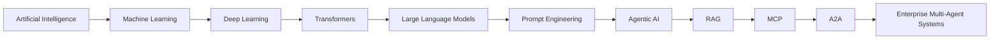

# Welcome to the Complete Agentic AI Handbook

---

## Purpose

Artificial Intelligence has evolved from rule-based systems to autonomous multi-agent platforms capable of reasoning, planning, memory management, and enterprise integration.

This handbook provides a structured learning path from AI fundamentals to production-ready enterprise Agentic AI systems.

---

## Learning Path

---

## Book Philosophy

This handbook emphasizes:

- Enterprise-first architecture
- Production-grade implementations
- Design patterns
- Security and governance
- Cloud-native deployment
- Practical code examples
- Real-world case studies

---

## Audience

This book is intended for:

- Enterprise Architects
- Solution Architects
- Principal Engineers
- AI Engineers
- Technical Leads
- Java Developers
- Cloud Architects
- Engineering Managers

---

## How to Read This Book

If you are new to AI:

Start with Part I and progress sequentially.

If you are an experienced software architect:

You may jump directly to:

- Agent Architecture
- MCP
- A2A
- Enterprise AI
- LangGraph
- Spring AI

---

## Enterprise Focus

Unlike many AI resources that emphasize experimentation, this handbook addresses the concerns of enterprise adoption, including:

- Scalability
- Security
- Compliance
- Governance
- Observability
- Cost optimization
- High availability
- Integration with existing systems

---

## Core Technologies Covered

| Category         | Technologies                         |
| ---------------- | ------------------------------------ |
| AI               | GPT, Claude, Gemini, Llama           |
| Java             | Java 21, Spring Boot, Spring AI      |
| Cloud            | Azure AI Foundry, Azure OpenAI, AKS  |
| Databases        | PostgreSQL, Redis, Neo4j, MongoDB    |
| Messaging        | Kafka                                |
| Agent Frameworks | LangGraph, OpenAI Agents SDK, CrewAI |

---

## Roadmap

The handbook is divided into six major parts:

1. Foundations
2. Agentic AI
3. Knowledge Systems
4. Enterprise Agent Systems
5. Frameworks
6. Enterprise Architecture

Each chapter builds on previous concepts and includes:

- Theory
- Enterprise architecture
- Mermaid diagrams
- Best practices
- Production considerations
- Interview preparation

---

Happy learning, and welcome to the world of Enterprise Agentic AI!
